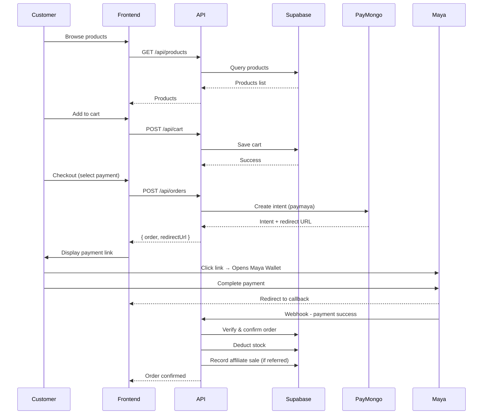
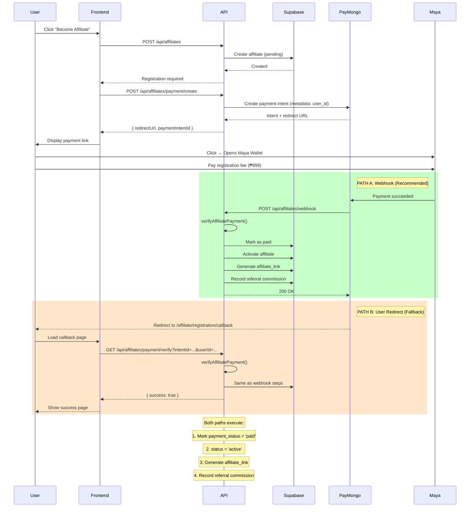
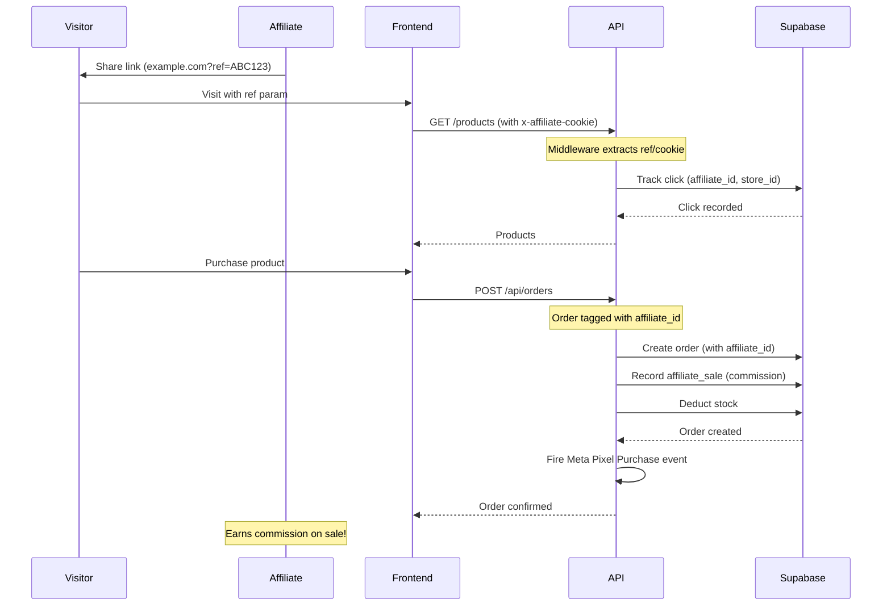

# Triad E-Commerce API - Complete Documentation

## Table of Contents

1. [Project Summary](#1-project-summary)
2. [Tech Stack](#2-tech-stack)
3. [Project Structure](#3-project-structure)
4. [API Modules & Endpoints](#4-api-modules--endpoints)
5. [Database Schema](#5-database-schema)
6. [Process Flows](#6-process-flows)
7. [Payment Processing](#7-payment-processing)
8. [Affiliate System](#8-affiliate-system)
9. [Meta Pixel Integration](#9-meta-pixel-integration)
10. [Environment Variables](#10-environment-variables)
11. [Running the Project](#11-running-the-project)
12. [Security Features](#12-security-features)
13. [API Documentation](#13-api-documentation)

---

## 1. Project Summary

**Triad-Ecomm** is a full-featured e-commerce backend API with affiliate marketing capabilities. It provides a complete solution for:

- User authentication (email/password + Google OAuth)
- Product catalog management
- Shopping cart functionality
- Order processing with multiple payment methods
- Affiliate program with commission tracking
- Meta Pixel event integration for analytics
- Inventory/stock management
- Wishlist functionality
- Product testimonials/reviews

---

## 2. Tech Stack

| Layer          | Technology                               |
| -------------- | ---------------------------------------- |
| Runtime        | Node.js                                  |
| Framework      | Express.js                               |
| Language       | TypeScript                               |
| Database       | Supabase (PostgreSQL)                    |
| Authentication | Supabase Auth + Google OAuth             |
| Payments       | PayMongo (Maya Wallet, GCash, Card, COD) |
| Analytics      | Meta Pixel Events                        |

---

## 3. Project Structure

```
src/
├── app.ts                 # Express app setup & route registration
├── server.ts              # Server entry point
│
├── common/
│   ├── constants/         # App constants (roles, etc.)
│   ├── middlewares/       # Express middlewares
│   │   ├── affiliateTracking.ts   # Tracks affiliate referrals
│   │   ├── errorHandler.ts         # Global error handling
│   │   ├── logger.ts               # HTTP logging
│   │   ├── rateLimiter.ts          # Rate limiting
│   │   └── sanitize.ts             # Input sanitization
│   ├── resolvers/
│   │   └── owner.resolver.ts       # Auth/Guest resolution
│   ├── types/             # TypeScript declarations
│   ├── utils/             # AppError, catchAsync, response
│   └── validators/        # Zod validation schemas
│
├── config/
│   ├── env.ts             # Environment configuration
│   ├── supabase.ts        # Supabase client
│   └── swagger.ts         # OpenAPI spec
│
├── modules/               # Feature modules
│   ├── auth/              # Authentication
│   │   ├── auth.controller.ts
│   │   ├── auth.routes.ts
│   │   ├── auth.service.ts
│   │   ├── auth.middleware.ts
│   │   └── auth.validation.ts
│   │
│   ├── users/             # User management
│   │   ├── users.controller.ts
│   │   ├── users.routes.ts
│   │   ├── users.service.ts
│   │   └── users.repository.ts
│   │
│   ├── products/          # Product catalog
│   │   ├── products.controller.ts
│   │   ├── products.routes.ts
│   │   ├── products.service.ts
│   │   ├── products.repository.ts
│   │   └── products.admin.controller.ts
│   │
│   ├── cart/              # Shopping cart
│   │   ├── cart.controller.ts
│   │   ├── cart.routes.ts
│   │   ├── cart.service.ts
│   │   └── cart.repository.ts
│   │
│   ├── order/             # Orders & payments
│   │   ├── order.controller.ts
│   │   ├── order.routes.ts
│   │   ├── order.service.ts      # Payment processing
│   │   └── order.repository.ts
│   │
│   ├── stocks/            # Inventory management
│   │   ├── stocks.controller.ts
│   │   ├── stocks.routes.ts
│   │   ├── stocks.service.ts
│   │   └── stocks.repository.ts
│   │
│   ├── wishlist/          # User wishlists
│   │   ├── wishlist.controller.ts
│   │   ├── wishlist.routes.ts
│   │   ├── wishlist.service.ts
│   │   └── wishlist.repository.ts
│   │
│   ├── testimonials/      # Product reviews
│   │   ├── testimonials.public.controller.ts
│   │   ├── testimonials.admin.controller.ts
│   │   ├── testimonials.routes.ts
│   │   ├── testimonials.service.ts
│   │   └── testimonials.repository.ts
│   │
│   ├── affiliates/        # Affiliate program
│   │   ├── affiliate.controller.ts
│   │   ├── affiliate.routes.ts
│   │   ├── affiliate.service.ts  # Payment & activation
│   │   ├── affiliate.repository.ts
│   │   └── affiliate.types.ts
│   │
│   ├── affiliates-sales/  # Affiliate commissions
│   │   ├── affiliate-sales.controller.ts
│   │   ├── affiliate-sales.routes.ts
│   │   ├── affiliate-sales.service.ts
│   │   ├── affiliate-sales.repository.ts
│   │   └── affiliate-sales.types.ts
│   │
│   ├── affiliate-tracking/ # Click attribution
│   │   ├── affiliate-tracking.controller.ts
│   │   ├── affiliate-tracking.routes.ts
│   │   ├── affiliate-tracking.service.ts
│   │   ├── affiliate-tracking.repository.ts
│   │   └── affiliate-tracking.types.ts
│   │
│   └── affiliate-pixel/   # Meta Pixel events
│       ├── affiliate-pixel.controller.ts
│       ├── affiliate-pixel.routes.ts
│       ├── affiliate-pixel.service.ts
│       ├── affiliate-pixel.repository.ts
│       ├── affiliate-pixel.types.ts
│       └── affiliate-pixel.utils.ts
│
└── utils/
    └── paymongo.utils.ts  # Payment processing (Maya Wallet)
```

---

## 4. API Modules & Endpoints

### Authentication (`/api/auth`)

| Endpoint           | Method | Description                 |
| ------------------ | ------ | --------------------------- |
| `/register`        | POST   | Email/password registration |
| `/login`           | POST   | Email/password login        |
| `/google`          | GET    | Google OAuth redirect       |
| `/google/callback` | GET    | Google OAuth callback       |
| `/me`              | GET    | Get current user            |

### Products (`/api/products`)

| Endpoint | Method | Description                     |
| -------- | ------ | ------------------------------- |
| `/`      | GET    | List products (with pagination) |
| `/`      | POST   | Create product (admin)          |
| `/:id`   | GET    | Get product details             |
| `/:id`   | PUT    | Update product (admin)          |
| `/:id`   | DELETE | Delete product (admin)          |

### Cart (`/api/cart`)

| Endpoint   | Method | Description           |
| ---------- | ------ | --------------------- |
| `/`        | GET    | Get cart items        |
| `/`        | POST   | Add item to cart      |
| `/:itemId` | PUT    | Update item quantity  |
| `/:itemId` | DELETE | Remove item from cart |

### Orders (`/api/orders`)

| Endpoint                  | Method | Description           |
| ------------------------- | ------ | --------------------- |
| `/`                       | POST   | Place order           |
| `/`                       | GET    | Get user orders       |
| `/:id`                    | GET    | Get order details     |
| `/verify-gcash/:intentId` | GET    | Verify payment        |
| `/webhook/paymongo`       | POST   | PayMongo webhook      |
| `/admin/all`              | GET    | All orders (admin)    |
| `/admin/:id/status`       | PATCH  | Update status (admin) |

### Affiliates (`/api/affiliates`)

| Endpoint                   | Method | Description                     |
| -------------------------- | ------ | ------------------------------- |
| `/`                        | GET    | Get all affiliates (admin)      |
| `/`                        | POST   | Create affiliate (admin)        |
| `/me`                      | GET    | Get my affiliate info           |
| `/me/link`                 | GET    | Get my affiliate link           |
| `/me/pixel`                | PATCH  | Update my pixel ID              |
| `/payment/create`          | POST   | Create payment for registration |
| `/payment/verify`          | GET    | Verify payment (callback)       |
| `/webhook`                 | POST   | PayMongo webhook (recommended)  |
| `/settings`                | GET    | Get affiliate settings (admin)  |
| `/settings`                | PATCH  | Update settings (admin)         |
| `/:id`                     | GET    | Get affiliate by ID             |
| `/:id`                     | PATCH  | Update affiliate                |
| `/:id`                     | DELETE | Delete affiliate                |
| `/:id/suspend`             | PATCH  | Suspend affiliate               |
| `/:id/activate`            | PATCH  | Activate affiliate              |
| `/:id/products`            | GET    | Get affiliate products          |
| `/:id/products`            | POST   | Assign product to affiliate     |
| `/:id/products/:productId` | DELETE | Remove product from affiliate   |

### Affiliate Tracking (`/api/affiliate-tracking`)

| Endpoint                                 | Method | Description                  |
| ---------------------------------------- | ------ | ---------------------------- |
| `/resolve`                               | GET    | Resolve ref to affiliate     |
| `/affiliates/:id/tracking-links`         | POST   | Create tracking link         |
| `/affiliates/:id/tracking-links`         | GET    | List tracking links          |
| `/affiliates/:id/tracking-links/:linkId` | GET    | Get tracking link details    |
| `/affiliates/:id/tracking-links/:linkId` | PATCH  | Update tracking link         |
| `/affiliates/:id/tracking-links/:linkId` | DELETE | Delete tracking link         |
| `/attributions/orders/:orderId`          | GET    | Get order attribution        |
| `/attributions/orders/:orderId`          | POST   | Attribute order to affiliate |
| `/affiliates/:id/attributions`           | GET    | Get affiliate attributions   |
| `/affiliates/:id/tracking-stats`         | GET    | Get tracking statistics      |
| `/tracking/cookie-config`                | GET    | Get cookie configuration     |

### Affiliate Pixel (`/api/affiliate-pixel`)

| Endpoint | Method | Description         |
| -------- | ------ | ------------------- |
| `/`      | GET    | List pixel configs  |
| `/`      | POST   | Create pixel config |
| `/fire`  | POST   | Fire pixel event    |

### Affiliate Sales (`/api/affiliate-sales`)

| Endpoint         | Method | Description            |
| ---------------- | ------ | ---------------------- |
| `/`              | GET    | Get affiliate sales    |
| `/affiliate/:id` | GET    | Get sales by affiliate |

### Stocks (`/api/stocks`)

| Endpoint | Method | Description      |
| -------- | ------ | ---------------- |
| `/`      | GET    | Get all stocks   |
| `/:sku`  | GET    | Get stock by SKU |

### Wishlist (`/api/wishlist`)

| Endpoint      | Method | Description          |
| ------------- | ------ | -------------------- |
| `/`           | GET    | Get wishlist items   |
| `/`           | POST   | Add to wishlist      |
| `/:productId` | DELETE | Remove from wishlist |

### Testimonials (`/api/testimonials`)

| Endpoint | Method | Description        |
| -------- | ------ | ------------------ |
| `/`      | GET    | List testimonials  |
| `/`      | POST   | Create testimonial |
| `/:id`   | DELETE | Delete (admin)     |

### Users (`/api/users`)

| Endpoint | Method | Description      |
| -------- | ------ | ---------------- |
| `/me`    | GET    | Get current user |

---

## 5. Database Schema

### Key Tables

```sql
-- Users (extends Supabase auth)
users

-- Products
products
product_images

-- Shopping
cart_items
orders
order_items

-- Affiliate System
affiliates
  - user_id
  - payment_status (pending/paid)
  - status (pending/active)
  - pixel_id
  - store_id
  - affiliate_link
  - referred_by (FK to affiliates.id)
  - affiliate_commission (DECIMAL - earned from referrals)

affiliate_settings
  - key
  - value

affiliate_sales
  - affiliate_id
  - order_id
  - commission_amount

-- Tracking
affiliate_tracking
  - affiliate_id
  - click_id
  - store_id
  - tracking_method

affiliate_pixels
  - affiliate_id
  - pixel_id
  - store_id
```

### Migrations

| File                                           | Description                                |
| ---------------------------------------------- | ------------------------------------------ |
| `20260314_add_pixel_store_ids.sql`             | Add pixel and store ID columns             |
| `20260315_affiliate_tracking_pixel.sql`        | Affiliate tracking and pixel tables        |
| `20260316_auto_create_affiliate.sql`           | Auto-create affiliate on user registration |
| `20260317_add_affiliate_payment_status.sql`    | Add payment status to affiliates           |
| `20260318_fix_affiliates_rls_for_triggers.sql` | Fix RLS policies                           |
| `20260319_affiliate_link_commission.sql`       | Add affiliate link and commission columns  |
| `20260320_fix_trigger_with_affiliate_link.sql` | Fix trigger with affiliate link            |
| `20260321_add_referral_commission_columns.sql` | Add referral commission columns            |
| `20260322_add_affiliate_commission_column.sql` | Add affiliate commission column            |

---

## 6. Process Flows

### 6.1 Customer Purchase Flow



### 6.2 Affiliate Registration Flow



### 6.3 Affiliate Referral Flow



---

## 7. Payment Processing

### Supported Payment Methods

| Method  | Type      | Description           |
| ------- | --------- | --------------------- |
| `cod`   | Direct    | Cash on delivery      |
| `gcash` | Deep Link | Maya Wallet (PayMaya) |
| `card`  | Redirect  | Credit/Debit card     |

### PayMaya Implementation Details

The API uses **PayMaya** (not Maya) as the payment method identifier:

```typescript
// In paymongo.utils.ts
const paymentIntent = {
  payment_method_allowed: ["paymaya"], // PayMaya identifier
};

// When attaching payment method
const paymentMethod = {
  type: "paymaya", // Creates deep link to Maya Wallet
};
```

### Payment Flow

1. **Create Payment Intent** → API calls PayMongo to create intent
2. **Attach Payment Method** → Creates PayMaya payment method
3. **Get Redirect URL** → PayMongo returns deep link
4. **User Pays** → Opens Maya Wallet, completes payment
5. **Verify** → Webhook or callback verifies payment
6. **Confirm** → Order confirmed, stock deducted, affiliate credited

### Key Differences: QRPH vs PayMaya

| Feature        | QRPH (Previous)                    | PayMaya (New)                         |
| -------------- | ---------------------------------- | ------------------------------------- |
| Payment Type   | QR Code                            | Deep Link                             |
| User Action    | Scan QR with any wallet app        | Click link opens Maya directly        |
| Implementation | `payment_method_allowed: ["qrph"]` | `payment_method_allowed: ["paymaya"]` |
| Return Data    | `qrCodeUrl` (base64 image)         | `redirectUrl` (deep link URL)         |

---

## 8. Affiliate System

### Affiliate Status Flow

```
[New User]
    ↓ (registers)
[Pending] - Needs to pay registration fee
    ↓ (pays ₱999)
[Paid] - Payment verified
    ↓ (auto-activated)
[Active] - Can earn commissions
    ↓ (makes sale)
[Commission] - Earns from referrals
```

### Auto-Approval

After successful payment:

```typescript
// In affiliate.service.ts - verifyAffiliatePayment()
if (status === "succeeded") {
  await markAsPaidByUserId(userId); // Mark paid
  await activateByUserId(userId); // Auto-approve!
  await generateAndSetAffiliateLink(userId); // Generate unique link
  await recordReferralCommissionIfNeeded(affiliate, registrationFee);
}
```

### Payment Verification Endpoints

The backend provides two paths for payment verification:

| Path     | Endpoint                         | Method | Trigger                   | Reliability |
| -------- | -------------------------------- | ------ | ------------------------- | ----------- |
| Webhook  | `/api/affiliates/webhook`        | POST   | PayMongo server-to-server | ✅ High     |
| Callback | `/api/affiliates/payment/verify` | GET    | User browser redirect     | ⚠️ Medium   |

**Webhook (Recommended):**

- PayMongo sends server-to-server notification when payment succeeds
- Works even if user closes browser immediately
- No user interaction required

**Callback (Fallback):**

- User is redirected back to the site after payment
- Frontend calls backend to verify payment status
- Requires user to return to the site

### Commission Tracking

- Commission recorded in `affiliate_sales` table
- Calculated per order
- Can be triggered on:
  - Order payment confirmed (GCash)
  - Order delivered (COD)

### Referral Commission (Affiliate-to-Affiliate)

When a new affiliate registers using another affiliate's referral link, the referrer earns a commission:

```typescript
// In affiliate.service.ts - verifyAffiliatePayment()
const settings = await affiliateRepository.getSettings();
await recordReferralCommissionIfNeeded(affiliate, settings.registrationFee);

// In recordReferralCommission()
// 1. Get referrer from affiliate.referred_by
// 2. Calculate commission:
//    - percentage: (paymentAmount * rate) / 100
//    - fixed: rate (from settings)
// 3. Update referrer's affiliate_commission column
```

**Commission Settings** (stored in `affiliate_settings` table):

| Key                        | Default    | Description             |
| -------------------------- | ---------- | ----------------------- |
| `registration_fee`         | 999        | Registration fee amount |
| `referral_commission_rate` | 20         | Commission rate         |
| `referral_commission_type` | percentage | 'percentage' or 'fixed' |

**Database Columns:**

| Column                 | Type          | Description                                       |
| ---------------------- | ------------- | ------------------------------------------------- |
| `referred_by`          | UUID          | FK to affiliates.id - who referred this affiliate |
| `affiliate_commission` | DECIMAL(10,2) | Total commission earned from referrals            |

---

## 9. Meta Pixel Integration

### Supported Events

| Event      | Trigger                |
| ---------- | ---------------------- |
| `Lead`     | Affiliate registration |
| `Purchase` | Order completed        |

### Pixel Configuration

Each affiliate can have:

- `pixel_id` - Meta Pixel ID
- `store_id` - Store identifier
- Access token configured via env: `META_ACCESS_TOKEN`

### Purchase Event

```json
{
  "event_name": "Purchase",
  "event_time": 1699123456,
  "event_id": "order_123_unique_id",
  "user_data": {
    "em": ["hash@example.com"],
    "client_ip_address": "192.168.1.1",
    "client_user_agent": "Mozilla/5.0..."
  },
  "custom_data": {
    "value": 99.99,
    "currency": "PHP",
    "contents": [{ "id": "product_1", "quantity": 2, "item_price": 49.99 }],
    "order_id": "order_123"
  },
  "event_source_url": "https://store.com/checkout",
  "action_source": "WEBSITE"
}
```

### Lead Event

```json
{
  "event_name": "Lead",
  "event_time": 1699123456,
  "event_id": "lead_123_unique_id",
  "user_data": {
    "em": ["hash@example.com"],
    "fn": ["John"],
    "ln": ["Doe"]
  },
  "custom_data": {
    "value": 0,
    "currency": "PHP",
    "lead_type": "affiliate_signup"
  },
  "event_source_url": "https://store.com/affiliate/signup",
  "action_source": "WEBSITE"
}
```

---

## 10. Environment Variables

### Required Variables

```env
# Supabase
SUPABASE_URL=https://xxx.supabase.co
SUPABASE_ANON_KEY=xxx
SUPABASE_SERVICE_ROLE_KEY=xxx

# App
NODE_ENV=development
PORT=3001
FRONTEND_URL=http://localhost:3000
BACKEND_URL=http://localhost:3001
PASSWORD_PEPPER=your-secure-pepper-min-16-chars

# Payments
PAYMONGO_SECRET_KEY=sk_live_xxx

# Affiliate
AFFILIATE_REGISTRATION_FEE=999

# Meta Pixel (optional)
META_ACCESS_TOKEN=xxx
```

### Environment Variable Details

| Variable                   | Default     | Description                               |
| -------------------------- | ----------- | ----------------------------------------- |
| PORT                       | 3000        | Express server port                       |
| NODE_ENV                   | development | Environment (development/production/test) |
| FRONTEND_URL               | -           | Frontend URL (Next.js on port 3000)       |
| BACKEND_URL                | -           | Backend URL (Express on port 3001)        |
| AFFILIATE_REGISTRATION_FEE | 999         | Registration fee for affiliates           |

---

## 11. Running the Project

### Development

```bash
npm run dev
# Server: http://localhost:3001 (Express backend)
# Frontend: http://localhost:3000 (Next.js)
# Swagger: http://localhost:3001/api/docs
```

### Build & Production

```bash
npm run build
npm start
```

### Database

```bash
npm run db:migrate      # Push migrations
npm run db:types        # Generate TypeScript types
npm run db:migration:create  # Create new migration
```

### Testing

```bash
npm test
```

---

## 12. Security Features

- **Helmet.js** - HTTP security headers
- **CORS** - Configured for frontend origin
- **Rate Limiting** - Prevents abuse
- **Input Sanitization** - MongoDB sanitize
- **Zod Validation** - Request validation
- **RLS Policies** - Supabase row-level security
- **Password Hashing** - bcrypt
- **Parameter Pollution** - HPP protection

### Cookie Security

- HttpOnly: false (needs JavaScript access)
- Secure: true (HTTPS only in production)
- SameSite: "Lax" (allows navigation) or "Strict"
- Max-Age: 30 days

---

## 13. API Documentation

Swagger UI is available at `/api/docs` in development mode.

### Quick Links

| Resource     | Path               |
| ------------ | ------------------ |
| Swagger UI   | `/api/docs`        |
| Swagger JSON | `/api/docs.json`   |
| Health Check | `/health`          |
| Google OAuth | `/api/auth/google` |

---

## Package.json Scripts

| Script                        | Description                 |
| ----------------------------- | --------------------------- |
| `npm run dev`                 | Start development server    |
| `npm run build`               | Build for production        |
| `npm start`                   | Start production server     |
| `npm run typecheck`           | Type check without emitting |
| `npm test`                    | Run tests                   |
| `npm run db:migrate`          | Push database migrations    |
| `npm run db:types`            | Generate TypeScript types   |
| `npm run db:migration:create` | Create new migration        |

---

## Dependencies

### Production Dependencies

| Package                | Version | Purpose                        |
| ---------------------- | ------- | ------------------------------ |
| @supabase/supabase-js  | ^2.45.0 | Supabase client                |
| bcryptjs               | ^2.4.3  | Password hashing               |
| cookie-parser          | ^1.4.7  | Cookie parsing                 |
| cors                   | ^2.8.5  | CORS middleware                |
| dotenv                 | ^17.3.1 | Environment variables          |
| express                | ^4.21.0 | Web framework                  |
| express-mongo-sanitize | ^2.2.0  | Input sanitization             |
| express-rate-limit     | ^7.5.0  | Rate limiting                  |
| helmet                 | ^8.0.0  | Security headers               |
| hpp                    | ^0.2.3  | Parameter pollution prevention |
| morgan                 | ^1.10.0 | HTTP logging                   |
| multer                 | ^2.1.0  | File uploads                   |
| swagger-jsdoc          | ^6.2.8  | Swagger documentation          |
| swagger-ui-express     | ^5.0.1  | Swagger UI                     |
| winston                | ^3.17.0 | Logging                        |
| zod                    | ^3.24.0 | Schema validation              |

---

## Appendix: Affiliate Tracking Design

### Database Tables for Tracking

#### affiliate_tracking_links

```sql
CREATE TABLE IF NOT EXISTS affiliate_tracking_links (
    id UUID PRIMARY KEY DEFAULT uuid_generate_v4(),
    affiliate_id UUID REFERENCES affiliates(id) ON DELETE CASCADE,
    store_id TEXT NOT NULL,
    campaign_name TEXT,
    landing_page_url TEXT,
    click_count INTEGER DEFAULT 0,
    conversion_count INTEGER DEFAULT 0,
    created_at TIMESTAMP WITH TIME ZONE DEFAULT NOW(),
    expires_at TIMESTAMP WITH TIME ZONE,
    is_active BOOLEAN DEFAULT true
);
```

#### affiliate_attributions

```sql
CREATE TABLE IF NOT EXISTS affiliate_attributions (
    id UUID PRIMARY KEY DEFAULT uuid_generate_v4(),
    order_id UUID REFERENCES orders(id) ON DELETE CASCADE,
    affiliate_id UUID REFERENCES affiliates(id) ON DELETE SET NULL,
    tracking_method VARCHAR(20) NOT NULL CHECK (tracking_method IN ('cookie', 'url_param', 'manual')),
    pixel_id TEXT,
    store_id TEXT,
    click_id TEXT,
    referrer_url TEXT,
    created_at TIMESTAMP WITH TIME ZONE DEFAULT NOW()
);
```

#### affiliate_pixel_events

```sql
CREATE TABLE IF NOT EXISTS affiliate_pixel_events (
    id UUID PRIMARY KEY DEFAULT uuid_generate_v4(),
    affiliate_id UUID REFERENCES affiliates(id) ON DELETE SET NULL,
    order_id UUID REFERENCES orders(id) ON DELETE SET NULL,
    event_type VARCHAR(50) NOT NULL CHECK (event_type IN ('Purchase', 'Lead', 'ViewContent', 'AddToCart')),
    pixel_id TEXT NOT NULL,
    event_id TEXT NOT NULL,
    event_data JSONB,
    status VARCHAR(20) DEFAULT 'pending' CHECK (status IN ('pending', 'sent', 'failed')),
    meta_response JSONB,
    retry_count INTEGER DEFAULT 0,
    created_at TIMESTAMP WITH TIME ZONE DEFAULT NOW(),
    sent_at TIMESTAMP WITH TIME ZONE
);
```

---

_Document Version: 2.0_
_Last Updated: 2026-03-17_
_Consolidated from: project-overview.md, affiliate-referral-system.md, affiliate-registration-callback-backend.md, affiliate-metapixel-design.md, maya-wallet-implementation.md_
