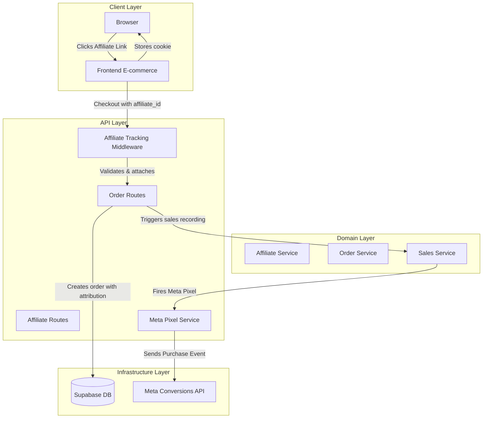
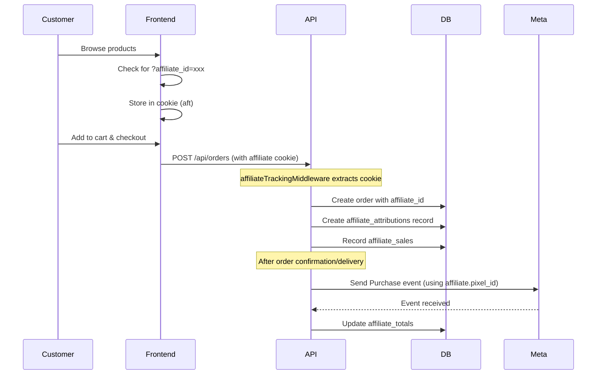

# Affiliate System with Meta Pixel Integration - Design Document

## Executive Summary

This document outlines the design for a comprehensive affiliate tracking system with Meta Pixel (Facebook Pixel) integration. The system enables:

- Affiliate tracking via unique links with `pixel_id` and `store_id`
- Cookie-based and URL-parameter based attribution
- Automatic Meta Pixel event firing (Purchase, Lead) per affiliate
- Manual affiliate assignment by admins
- Clean architecture with clear separation of concerns

---

## 1. System Architecture Overview

### 1.1 High-Level Flow



### 1.2 Module Structure

```
src/
├── modules/
│   ├── affiliates/              # Existing affiliate management
│   ├── affiliate-tracking/      # NEW: Tracking & attribution
│   │   ├── affiliate-tracking.types.ts
│   │   ├── affiliate-tracking.service.ts
│   │   ├── affiliate-tracking.repository.ts
│   │   ├── affiliate-tracking.controller.ts
│   │   └── affiliate-tracking.routes.ts
│   ├── affiliate-pixel/        # NEW: Meta Pixel integration
│   │   ├── meta-pixel.types.ts
│   │   ├── meta-pixel.service.ts
│   │   ├── meta-pixel.repository.ts
│   │   └── meta-pixel.utils.ts
│   ├── affiliates-sales/       # Existing sales tracking
│   └── order/                  # Existing order management
├── common/
│   ├── middlewares/
│   │   └── affiliateTracking.ts  # NEW: Cookie parsing middleware
│   └── utils/
│       └── metaPixelUtils.ts      # NEW: Pixel event builder
```

---

## 2. Database Schema Design

### 2.1 New Tables

#### affiliate_tracking_links

Tracks generated affiliate links and their usage.

```sql
CREATE TABLE IF NOT EXISTS affiliate_tracking_links (
    id UUID PRIMARY KEY DEFAULT uuid_generate_v4(),
    affiliate_id UUID REFERENCES affiliates(id) ON DELETE CASCADE,
    store_id TEXT NOT NULL,
    campaign_name TEXT,
    landing_page_url TEXT,
    click_count INTEGER DEFAULT 0,
    conversion_count INTEGER DEFAULT 0,
    created_at TIMESTAMP WITH TIME ZONE DEFAULT NOW(),
    expires_at TIMESTAMP WITH TIME ZONE,
    is_active BOOLEAN DEFAULT true
);
```

#### affiliate_attributions

Stores the attribution for each order (cookie-based or URL-based).

```sql
CREATE TABLE IF NOT EXISTS affiliate_attributions (
    id UUID PRIMARY KEY DEFAULT uuid_generate_v4(),
    order_id UUID REFERENCES orders(id) ON DELETE CASCADE,
    affiliate_id UUID REFERENCES affiliates(id) ON DELETE SET NULL,
    tracking_method VARCHAR(20) NOT NULL CHECK (tracking_method IN ('cookie', 'url_param', 'manual')),
    pixel_id TEXT,
    store_id TEXT,
    click_id TEXT,
    referrer_url TEXT,
    created_at TIMESTAMP WITH TIME ZONE DEFAULT NOW()
);
```

#### affiliate_pixel_events

Logs Meta Pixel events fired for each conversion.

```sql
CREATE TABLE IF NOT EXISTS affiliate_pixel_events (
    id UUID PRIMARY KEY DEFAULT uuid_generate_v4(),
    affiliate_id UUID REFERENCES affiliates(id) ON DELETE SET NULL,
    order_id UUID REFERENCES orders(id) ON DELETE SET NULL,
    event_type VARCHAR(50) NOT NULL CHECK (event_type IN ('Purchase', 'Lead', 'ViewContent', 'AddToCart')),
    pixel_id TEXT NOT NULL,
    event_id TEXT NOT NULL,
    event_data JSONB,
    status VARCHAR(20) DEFAULT 'pending' CHECK (status IN ('pending', 'sent', 'failed')),
    meta_response JSONB,
    retry_count INTEGER DEFAULT 0,
    created_at TIMESTAMP WITH TIME ZONE DEFAULT NOW(),
    sent_at TIMESTAMP WITH TIME ZONE
);
```

### 2.2 Updates to Existing Tables

#### orders table - Add affiliate tracking fields

```sql
ALTER TABLE orders ADD COLUMN IF NOT EXISTS affiliate_id UUID REFERENCES affiliates(id) ON DELETE SET NULL;
ALTER TABLE orders ADD COLUMN IF NOT EXISTS tracking_method VARCHAR(20);
ALTER TABLE orders ADD COLUMN IF NOT EXISTS click_id TEXT;
```

#### affiliates table - Enhance pixel settings

```sql
ALTER TABLE affiliates ADD COLUMN IF NOT EXISTS pixel_access_token TEXT;
ALTER TABLE ADD COLUMN IF NOT EXISTS enable_purchase_event BOOLEAN DEFAULT true;
ALTER TABLE ADD COLUMN IF NOT EXISTS enable_lead_event BOOLEAN DEFAULT false;
ALTER TABLE ADD COLUMN IF NOT EXISTS conversion_value_type VARCHAR(20) DEFAULT 'sale_amount' CHECK (conversion_value_type IN ('sale_amount', 'commission', 'fixed'));
ALTER TABLE ADD COLUMN IF NOT EXISTS conversion_value_fixed DECIMAL(10, 2);
```

---

## 3. Core Modules Design

### 3.1 Affiliate Tracking Module

#### Purpose

Handles affiliate link generation, tracking, and attribution.

#### Types (affiliate-tracking.types.ts)

```typescript
// Affiliate Tracking Link
export interface AffiliateTrackingLink {
  id: string;
  affiliateId: string;
  storeId: string;
  campaignName?: string;
  landingPageUrl?: string;
  clickCount: number;
  conversionCount: number;
  createdAt: string;
  expiresAt?: string;
  isActive: boolean;
}

// Tracking Link Generation DTO
export interface CreateTrackingLinkDTO {
  affiliateId: string;
  storeId: string;
  campaignName?: string;
  landingPageUrl?: string;
  expiresAt?: string;
}

// Attribution Data
export interface AttributionData {
  affiliateId?: string;
  pixelId?: string;
  storeId?: string;
  clickId?: string;
  trackingMethod: "cookie" | "url_param" | "manual" | "none";
  referrerUrl?: string;
}

// Order Attribution DTO
export interface AttributeOrderDTO {
  orderId: string;
  affiliateId?: string;
  trackingMethod: "cookie" | "url_param" | "manual";
  pixelId?: string;
  storeId?: string;
  clickId?: string;
}
```

#### Service Methods (affiliate-tracking.service.ts)

```typescript
// Generate unique tracking link for an affiliate
export const generateTrackingLink = (dto: CreateTrackingLinkDTO): string

// Record a click on affiliate link
export const recordClick = (affiliateId: string, storeId: string, referrerUrl?: string): { clickId: string }

// Get attribution data from cookies
export const getAttributionFromCookie = (cookies: Record<string, string>): AttributionData

// Get attribution data from URL parameters
export const getAttributionFromUrl = (query: Record<string, string>): AttributionData

// Merge cookie and URL attribution (URL takes precedence)
export const mergeAttribution = (cookieData: AttributionData, urlData: AttributionData): AttributionData

// Attribute an order to an affiliate
export const attributeOrder = async (dto: AttributeOrderDTO): Promise<void>

// Get tracking statistics for an affiliate
export const getTrackingStats = (affiliateId: string, startDate?: string, endDate?: string): Promise<TrackingStats>
```

### 3.2 Meta Pixel Module

#### Purpose

Handles Meta Pixel event creation and sending to Meta Conversions API.

#### Types (meta-pixel.types.ts)

```typescript
// Meta Pixel Event Types
export type MetaEventType =
  | "Purchase"
  | "Lead"
  | "ViewContent"
  | "AddToCart"
  | "CompleteRegistration";

// Meta Pixel Event Data
export interface MetaPixelEvent {
  eventName: MetaEventType;
  eventTime: number;
  eventId: string;
  userData: {
    em?: string[];
    ph?: string[];
    fn?: string[];
    ln?: string[];
    ct?: string[];
    st?: string[];
    zp?: string[];
    country?: string[];
    client_ip_address?: string;
    client_user_agent?: string;
    fbc?: string;
    fbp?: string;
  };
  customData: {
    value: number;
    currency: string;
    content_ids?: string[];
    content_type?: string;
    contents?: Array<{
      id: string;
      quantity: number;
      item_price?: number;
    }>;
    order_id?: string;
    pixelId?: string;
    storeId?: string;
  };
  eventSourceUrl?: string;
  actionSource: "WEBSITE" | "APP" | "EMAIL" | "PHONE" | "SYSTEM" | "OTHER";
}

// Pixel Configuration
export interface PixelConfig {
  pixelId: string;
  accessToken?: string;
  enablePurchase: boolean;
  enableLead: boolean;
  conversionValueType: "sale_amount" | "commission" | "fixed";
  fixedValue?: number;
}
```

#### Service Methods (meta-pixel.service.ts)

```typescript
// Build Purchase event for an order
export const buildPurchaseEvent = (
  order: Order,
  affiliate: Affiliate,
  pixelConfig: PixelConfig
): MetaPixelEvent

// Build Lead event for a conversion
export const buildLeadEvent = (
  order: Order,
  affiliate: Affiliate,
  pixelConfig: PixelConfig
): MetaPixelEvent

// Send event to Meta Conversions API
export const sendPixelEvent = async (
  event: MetaPixelEvent,
  pixelId: string,
  accessToken?: string
): Promise<{ success: boolean; metaResponse?: any; error?: string }>

// Fire purchase event for an affiliate sale
export const firePurchaseEvent = async (
  sale: AffiliateSale,
  order: Order
): Promise<PixelEventResult>

// Fire lead event
export const fireLeadEvent = async (
  orderId: string,
  affiliateId: string
): Promise<PixelEventResult>

// Retry failed pixel events
export const retryFailedEvents = (limit?: number): Promise<void>

// Get pixel event status
export const getPixelEventStatus = (eventId: string): Promise<PixelEventRecord>
```

### 3.3 Affiliate Tracking Middleware

#### Purpose

Extract affiliate attribution from cookies/URL and attach to request.

```typescript
// Middleware to extract and attach affiliate tracking
export const affiliateTrackingMiddleware = (
  req: Request,
  res: Response,
  next: NextFunction
): void

// Cookie naming convention
const AFFILIATE_COOKIE_NAME = 'aft';
const COOKIE_MAX_AGE = 30 * 24 * 60 * 60 * 1000; // 30 days

// Cookie format (Base64 encoded JSON)
interface AffiliateCookieData {
  aid: string;   // affiliate_id
  pid: string;   // pixel_id
  sid: string;   // store_id
  cid: string;   // click_id
  ts: number;    // timestamp
}
```

---

## 4. API Endpoints Design

### 4.1 Affiliate Tracking Endpoints

| Method | Endpoint                              | Description                          | Auth   |
| ------ | ------------------------------------- | ------------------------------------ | ------ |
| GET    | `/api/affiliates/:id/tracking-link`   | Generate tracking link for affiliate | Admin  |
| GET    | `/api/affiliates/:id/tracking-links`  | List all tracking links              | Admin  |
| GET    | `/api/affiliates/:id/stats`           | Get tracking statistics              | Admin  |
| POST   | `/api/affiliates/:id/attribute-order` | Manually attribute order             | Admin  |
| GET    | `/api/tracking/click`                 | Record click (redirects to landing)  | Public |
| POST   | `/api/tracking/convert`               | Record conversion (for server-side)  | Public |

### 4.2 Meta Pixel Endpoints

| Method | Endpoint                           | Description                   | Auth   |
| ------ | ---------------------------------- | ----------------------------- | ------ |
| GET    | `/api/affiliates/:id/pixel-config` | Get pixel configuration       | Admin  |
| PATCH  | `/api/affiliates/:id/pixel-config` | Update pixel settings         | Admin  |
| GET    | `/api/affiliates/:id/pixel-events` | List pixel events             | Admin  |
| POST   | `/api/affiliates/:id/test-pixel`   | Test pixel configuration      | Admin  |
| POST   | `/api/pixel/webhook`               | Meta Pixel webhook (optional) | Public |

---

## 5. Order Attribution Flow

### 5.1 Checkout Flow with Affiliate Attribution



### 5.2 Attribution Priority

1. **URL Parameter** (highest priority): `?affiliate_id=xxx&store_id=yyy`
2. **Cookie**: Stored from previous affiliate link click
3. **Manual Assignment**: Admin assigns after the fact
4. **None**: No attribution

---

## 6. Meta Pixel Event Specifications

### 6.1 Purchase Event

```json
{
  "event_name": "Purchase",
  "event_time": 1699123456,
  "event_id": "order_123_unique_id",
  "user_data": {
    "em": ["hash@example.com"],
    "client_ip_address": "192.168.1.1",
    "client_user_agent": "Mozilla/5.0..."
  },
  "custom_data": {
    "value": 99.99,
    "currency": "PHP",
    "contents": [{ "id": "product_1", "quantity": 2, "item_price": 49.99 }],
    "order_id": "order_123"
  },
  "event_source_url": "https://store.com/checkout",
  "action_source": "WEBSITE"
}
```

### 6.2 Lead Event

```json
{
  "event_name": "Lead",
  "event_time": 1699123456,
  "event_id": "lead_123_unique_id",
  "user_data": {
    "em": ["hash@example.com"],
    "fn": ["John"],
    "ln": ["Doe"]
  },
  "custom_data": {
    "value": 0,
    "currency": "PHP",
    "lead_type": "affiliate_signup"
  },
  "event_source_url": "https://store.com/affiliate/signup",
  "action_source": "WEBSITE"
}
```

---

## 7. Security Considerations

### 7.1 Cookie Security

- HttpOnly: false (needs JavaScript access)
- Secure: true (HTTPS only in production)
- SameSite: "Lax" (allows navigation) or "Strict"
- Max-Age: 30 days

### 7.2 Validation

- Validate affiliate_id exists and is active
- Validate pixel_id format (numeric)
- Validate store_id format
- Rate limiting on click tracking endpoint

### 7.3 Access Control

- Pixel configuration: Admin only
- Manual attribution: Admin only
- Tracking stats: Admin/Affiliate (own stats only)

---

## 8. Implementation Priorities

### Phase 1: Core Tracking (Week 1)

1. Database migrations for new tables
2. Affiliate tracking types and interfaces
3. Tracking link generation service
4. Cookie middleware
5. Basic attribution at checkout

### Phase 2: Meta Pixel Integration (Week 2)

1. Meta Pixel service
2. Event builder utilities
3. Integration with order confirmation
4. Pixel event logging

### Phase 3: Management Features (Week 3)

1. Admin dashboard for pixel config
2. Manual attribution UI
3. Tracking statistics
4. Test pixel functionality

### Phase 4: Advanced Features (Week 4)

1. URL parameter tracking
2. Click ID tracking (gclid, fbclid)
3. Webhook receiver
4. Event retry mechanism

---

## 9. Environment Variables

```env
# Meta Pixel Configuration
META_APP_ID=your_app_id
META_APP_SECRET=your_app_secret
META_ACCESS_TOKEN=your_system_user_access_token

# Affiliate Configuration
AFFILIATE_COOKIE_NAME=aft
AFFILIATE_COOKIE_MAX_AGE=2592000
AFFILIATE_URL_PARAM=affiliate_id
STORE_ID_URL_PARAM=store_id

# Tracking
TRACKING_BASE_URL=https://api.yourdomain.com
FRONTEND_URL=https://yourstore.com
```

---

## 10. Testing Strategy

### Unit Tests

- Attribution data extraction (cookie, URL)
- Pixel event builder
- Tracking link generator

### Integration Tests

- End-to-end checkout with attribution
- Meta Pixel event sending
- Order attribution persistence

### Manual Testing

- Affiliate link click flow
- Cookie storage and retrieval
- Pixel Test Tool validation

---

_Document Version: 1.0_
_Created: 2026-03-15_
