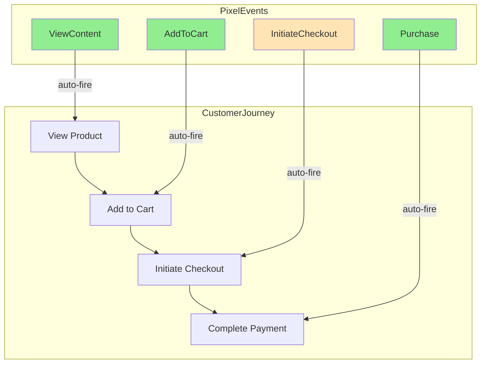
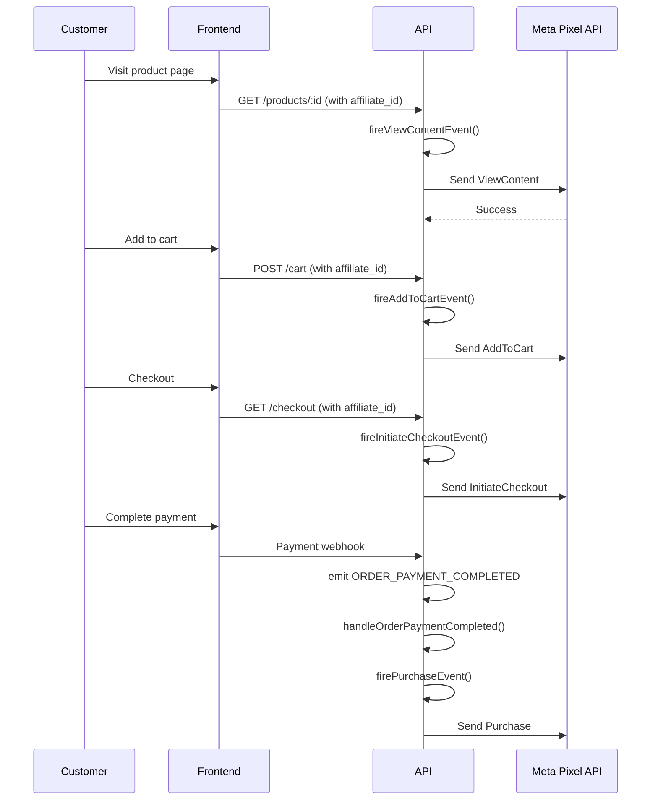

# Implementation Plan: Automatic Pixel Tracking on All Views

## Overview

This plan enables automatic firing of Facebook/Meta pixel events across the entire customer journey: product views, add to cart, checkout, and purchase. Currently, pixel tracking requires manual API calls; this implementation makes it automatic.

## Complete Customer Journey Events

| Customer Action   | Pixel Event      | Current Status     | Implementation Priority |
| ----------------- | ---------------- | ------------------ | ----------------------- |
| View product page | ViewContent      | ✅ Utility exists  | HIGH                    |
| Add to cart       | AddToCart        | ✅ Utility exists  | HIGH                    |
| Initiate checkout | InitiateCheckout | ❌ Not implemented | MEDIUM                  |
| Complete purchase | Purchase         | ✅ Utility exists  | HIGH                    |
| First purchase    | Lead             | ✅ Utility exists  | LOW                     |

## Architecture



## Implementation Steps

### Step 1: Implement ViewContent Event on Product View

**File:** `src/modules/products/products.controller.ts`

Modify [`getProduct`](src/modules/products/products.controller.ts) to fire ViewContent event:

```typescript
export const getProduct = catchAsync(
  async (req: Request, res: Response): Promise<void> => {
    const product = await productRepo.findById(id);

    // Fire ViewContent pixel event if affiliate attribution exists
    const attribution = (req as any).affiliateAttribution;
    if (attribution?.affiliateId && product) {
      const { fireViewContentEvent } =
        await import("../../application/use-cases/affiliate-pixel/FireViewContentEvent");
      // Fire async, don't wait - don't slow down response
      fireViewContentEvent({
        productId: product.id,
        value: product.price,
        affiliateId: attribution.affiliateId,
      }).catch(console.error);
    }

    sendSuccess(res, product);
  },
);
```

**New File:** `src/application/use-cases/affiliate-pixel/FireViewContentEvent.ts`

Create use case to fire ViewContent event using [`buildViewContentEvent`](src/modules/affiliate-pixel/affiliate-pixel.utils.ts:247).

---

### Step 2: Implement AddToCart Event on Add to Cart

**File:** `src/modules/cart/cart.controller.ts`

Modify [`addToCart`](src/modules/cart/cart.controller.ts:35):

```typescript
export const addToCart = catchAsync(
  async (req: Request, res: Response): Promise<void> => {
    const item = await cartRepo.upsert(owner, dto);

    // Fire AddToCart pixel event if affiliate attribution exists
    const attribution = (req as any).affiliateAttribution;
    if (attribution?.affiliateId) {
      const { fireAddToCartEvent } =
        await import("../../application/use-cases/affiliate-pixel/FireAddToCartEvent");
      fireAddToCartEvent({
        productId: dto.productId,
        value: dto.price,
        quantity: dto.quantity,
        affiliateId: attribution.affiliateId,
      }).catch(console.error);
    }

    sendSuccess(res, item, "Added to cart", 201);
  },
);
```

**New File:** `src/application/use-cases/affiliate-pixel/FireAddToCartEvent.ts`

Create use case to fire AddToCart event using [`buildAddToCartEvent`](src/modules/affiliate-pixel/affiliate-pixel.utils.ts:285).

---

### Step 3: Implement InitiateCheckout Event (New)

**File:** `src/modules/affiliate-pixel/affiliate-pixel.utils.ts`

Add `buildInitiateCheckoutEvent` function:

```typescript
export const buildInitiateCheckoutEvent = (params: {
  productIds: string[];
  value: number;
  currency: string;
  customerEmail?: string;
  clientIp?: string;
  userAgent?: string;
  fbc?: string;
  fbp?: string;
  eventSourceUrl?: string;
}): MetaPixelEvent => {
  const eventId = generateEventId(
    params.productIds.join("-"),
    "InitiateCheckout",
  );

  return {
    eventName: "InitiateCheckout",
    eventTime: Math.floor(Date.now() / 1000),
    eventId,
    userData: buildUserData({
      email: params.customerEmail,
      clientIp: params.clientIp,
      userAgent: params.userAgent,
      fbc: params.fbc,
      fbp: params.fbp,
    }),
    customData: {
      value: params.value,
      currency: params.currency,
      content_ids: params.productIds,
      content_type: "product",
    },
    eventSourceUrl: params.eventSourceUrl,
    actionSource: "WEBSITE",
  };
};
```

**New File:** `src/application/use-cases/affiliate-pixel/FireInitiateCheckoutEvent.ts`

Create use case to fire InitiateCheckout event. This should be called when the checkout page is accessed.

---

### Step 4: Implement Purchase Event on Payment Completion

**File:** `src/common/events/handlers.ts`

Update [`handleOrderPaymentCompleted`](src/common/events/handlers.ts:17) to fire Purchase event:

```typescript
async function handleOrderPaymentCompleted(payload: {
  userId: string;
  orderId: string;
  affiliateId: string;
  amount: number;
}): Promise<void> {
  try {
    const affiliateRepository = resolve<IAffiliateRepository>(
      TOKENS.IAffiliateRepository,
    );

    const affiliate = await affiliateRepository.findById(payload.affiliateId);

    if (
      affiliate?.isActive() &&
      affiliate.pixelId &&
      affiliate.enablePurchaseEvent
    ) {
      const { firePurchaseEvent } =
        await import("../../application/use-cases/affiliate-pixel/FirePurchaseEvent");

      await firePurchaseEvent({
        orderId: payload.orderId,
        affiliateId: payload.affiliateId,
      });

      console.log(`[Pixel] Fired Purchase event for order ${payload.orderId}`);
    }
  } catch (error) {
    console.error("[Event] Error firing pixel event:", error);
  }
}
```

---

### Step 5: Implement Lead Event on First Purchase

**File:** `src/application/use-cases/affiliate-pixel/FireLeadEvent.ts`

Add logic to check if customer is first-time buyer:

```typescript
// Check if this is the customer's first order
const { data: orderCount } = await supabaseAdmin
  .from("orders")
  .select("id", { count: "exact" })
  .eq("user_id", order.user_id);

const isFirstPurchase = (orderCount?.length ?? 0) === 0;

if (isFirstPurchase && affiliate.enableLeadEvent) {
  // Fire lead event in addition to purchase event
  // Or fire separately
}
```

---

### Step 6: Payment Webhook to Trigger Events

**New File:** `src/modules/order/order.webhook.ts`

```typescript
import { emit, AppEvent } from "../../common/events";

export const handlePaymentWebhook = async (req: Request, res: Response) => {
  const { orderId, status, userId, affiliateId } = req.body;

  if (status === "succeeded" && affiliateId) {
    // Emit event for pixel handling
    emit(AppEvent.ORDER_PAYMENT_COMPLETED, {
      orderId,
      userId,
      affiliateId,
      amount: req.body.amount,
    });
  }

  res.json({ received: true });
};
```

---

## Files to Create/Modify

| File                                                                     | Action | Description                          |
| ------------------------------------------------------------------------ | ------ | ------------------------------------ |
| `src/application/use-cases/affiliate-pixel/FireViewContentEvent.ts`      | Create | Fire ViewContent on product view     |
| `src/application/use-cases/affiliate-pixel/FireAddToCartEvent.ts`        | Create | Fire AddToCart on add to cart        |
| `src/application/use-cases/affiliate-pixel/FireInitiateCheckoutEvent.ts` | Create | Fire InitiateCheckout on checkout    |
| `src/modules/affiliate-pixel/affiliate-pixel.utils.ts`                   | Modify | Add buildInitiateCheckoutEvent       |
| `src/modules/products/products.controller.ts`                            | Modify | Trigger ViewContent on product view  |
| `src/modules/cart/cart.controller.ts`                                    | Modify | Trigger AddToCart on add to cart     |
| `src/modules/order/order.controller.ts`                                  | Modify | Trigger InitiateCheckout on checkout |
| `src/common/events/handlers.ts`                                          | Modify | Trigger Purchase on payment          |
| `src/modules/order/order.webhook.ts`                                     | Create | Payment webhook                      |
| `src/application/use-cases/affiliate-pixel/FireLeadEvent.ts`             | Modify | Add first-purchase logic             |

---

## Event Flow Summary



---

## Implementation Priority

1. **Step 1 (HIGH):** ViewContent on product view
2. **Step 2 (HIGH):** AddToCart on add to cart
3. **Step 3 (MEDIUM):** InitiateCheckout on checkout
4. **Step 4 (HIGH):** Purchase on payment completion (requires Step 6)
5. **Step 6 (HIGH):** Payment webhook
6. **Step 5 (LOW):** Lead on first purchase

---

## Prerequisites

- All event triggers should be **non-blocking** - fire async, don't delay HTTP response
- Need to pass affiliate attribution headers through all controllers
- Database may need migrations for new tracking fields
