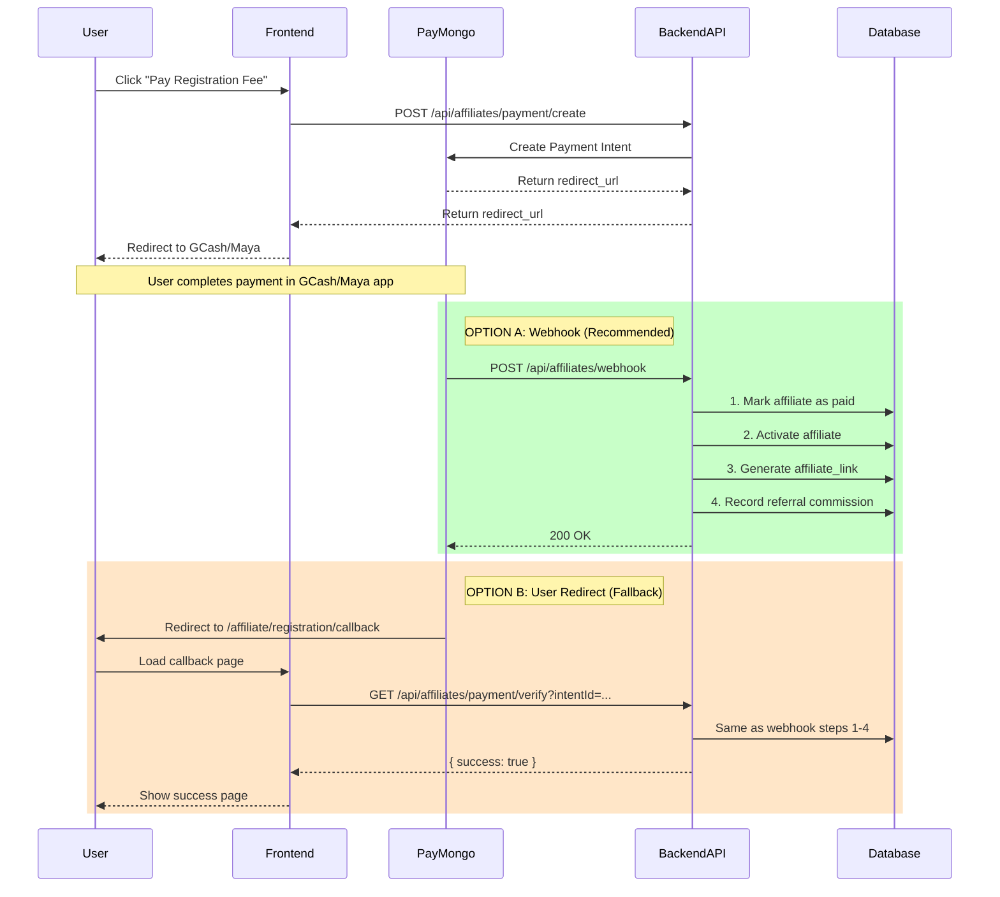

# Affiliate Registration Payment Callback - Pure Backend Architecture

## Current State Analysis

### Existing Backend Infrastructure (Already Implemented)

The backend already has the complete payment verification and commission recording logic:

| Component                | Location                                          | Purpose                                                     |
| ------------------------ | ------------------------------------------------- | ----------------------------------------------------------- |
| Webhook Endpoint         | `src/modules/affiliates/affiliate.routes.ts:8`    | `POST /api/affiliates/webhook` - receives PayMongo events   |
| Payment Verify Endpoint  | `src/modules/affiliates/affiliate.routes.ts:11`   | `GET /api/affiliates/payment/verify` - user return callback |
| verifyAffiliatePayment   | `src/modules/affiliates/affiliate.service.ts:217` | Core verification logic                                     |
| recordReferralCommission | `src/modules/affiliates/affiliate.service.ts:323` | Records commission for referrer                             |

### Current verifyAffiliatePayment Flow (lines 217-266 in affiliate.service.ts)

```
1. Verify payment status with PayMongo
2. Mark affiliate as paid (payment_status = "paid")
3. Activate affiliate (status = "active")
4. Generate affiliate_link
5. Call recordReferralCommissionIfNeeded() → recordReferralCommission()
```

### Current recordReferralCommission Flow (lines 323-362 in affiliate.service.ts)

```
1. Get referred affiliate by ID
2. Extract referrer_id from referred_by field
3. Get affiliate settings (commission rate & type)
4. Calculate commission:
   - percentage: (paymentAmount * rate) / 100
   - fixed: rate
5. Update referrer's affiliate_commission column
```

---

## Recommended Pure Backend Architecture

### Flow Diagram



### Two Verification Paths

| Path         | Trigger                   | Reliability | Use Case                                    |
| ------------ | ------------------------- | ----------- | ------------------------------------------- |
| **Webhook**  | PayMongo server-to-server | ✅ High     | Primary - works even if user closes browser |
| **Callback** | User browser redirect     | ⚠️ Medium   | Fallback - depends on user returning        |

---

## Implementation Plan

### Step 1: Ensure Webhook is Configured (Already Done ✓)

The webhook endpoint exists at [`src/modules/affiliates/affiliate.routes.ts:8`](src/modules/affiliates/affiliate.routes.ts:8):

```typescript
router.post("/webhook", affiliateController.paymongoWebhook);
```

And in [`affiliate.controller.ts:276`](src/modules/affiliates/affiliate.controller.ts:276):

```typescript
export const paymongoWebhook = catchAsync(
  async (req: Request, res: Response): Promise<void> => {
    const event = req.body?.data?.attributes;
    if (event.type === "payment.paid") {
      const intentId = event.data?.attributes?.payment_intent_id;
      const metadata = event.data?.attributes?.metadata;
      const userId = metadata?.user_id;
      if (intentId && userId) {
        await affiliateService.verifyAffiliatePayment(intentId, userId);
      }
    }
    sendSuccess(res, null, "Webhook received");
  },
);
```

### Step 2: Ensure Payment Intent Includes Metadata (Already Done ✓)

In [`affiliate.service.ts:134`](src/modules/affiliates/affiliate.service.ts:134):

```typescript
const intent = await paymongoUtils.createPaymentIntent(registrationFee, {
  user_id: userId,
  type: "affiliate_registration",
});
```

### Step 3: Frontend Callback Page (Simplified)

The frontend callback at `/affiliate/registration/callback` should:

1. Extract `intent_id` from URL query params
2. Call backend API to verify payment status
3. Display appropriate UI

**Current Issue:** Your frontend Next.js API route at `/api/affiliates/payment/verify` just redirects - it doesn't call the backend verification.

### Step 4: Remove Frontend API Route Conflict

The frontend has a Next.js API route at `/api/affiliates/payment/verify` that conflicts with the Express backend route. Options:

1. **Option A:** Remove the Next.js route, let Express handle it
2. **Option B:** Keep Next.js route but call backend for verification

---

## Recommended Actions

### Priority 1: Fix Frontend Callback to Call Backend

The callback page should call the backend:

```typescript
// In /affiliate/registration/callback page (client-side)
const result = await fetch(
  `/api/affiliates/payment/verify?intentId=${intentId}&userId=${userId}`,
);
const data = await result.json();
if (data.success) {
  // Show success UI
} else {
  // Show failure UI
}
```

### Priority 2: Test Webhook Flow

Ensure PayMongo is configured to send webhooks to your backend. The webhook is the more reliable path.

### Priority 3: Clean Up Route Conflict

Remove or refactor the Next.js `/api/affiliates/payment/verify` route to avoid confusion.

---

## Database Schema for Referral Commission

The commission is stored in the [`affiliates`](supabase/migrations/20260322_add_affiliate_commission_column.sql) table:

| Column                 | Type          | Description                                       |
| ---------------------- | ------------- | ------------------------------------------------- |
| `referred_by`          | UUID          | FK to affiliates.id - who referred this affiliate |
| `affiliate_commission` | DECIMAL(10,2) | Total commission earned from referrals            |

Commission settings are stored in [`affiliate_settings`](src/modules/affiliates/affiliate.repository.ts:452) table:

| Key                        | Default Value |
| -------------------------- | ------------- |
| `registration_fee`         | 999           |
| `referral_commission_rate` | 20            |
| `referral_commission_type` | percentage    |

---

## Summary

**Answer to your question:** Yes, the payment verification and commission recording should be in the backend - and it already is!

The backend has:

- ✅ Webhook endpoint (`/api/affiliates/webhook`) - most reliable
- ✅ Payment verify endpoint (`/api/affiliates/payment/verify`) - for callback flow
- ✅ `verifyAffiliatePayment()` function - handles all verification logic
- ✅ `recordReferralCommission()` function - records referral commission

You just need to ensure:

1. The frontend callback page calls the backend to verify
2. PayMongo is configured to send webhooks to your backend
