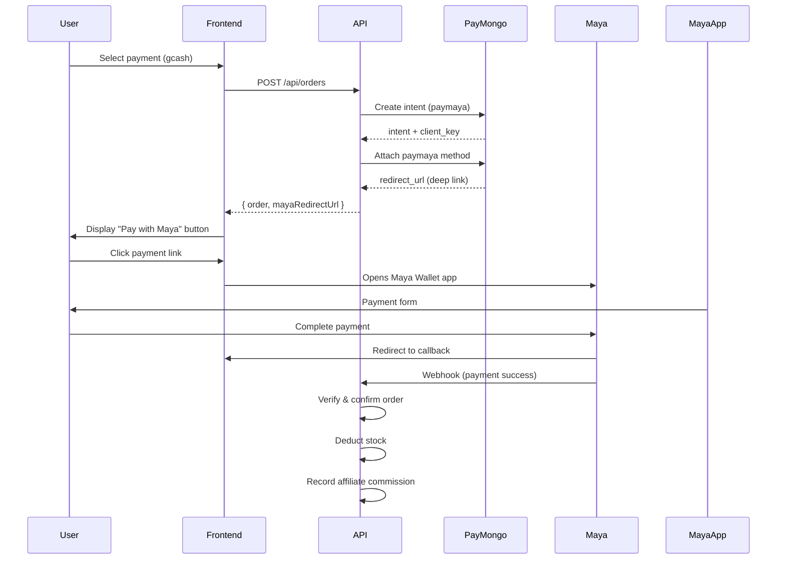
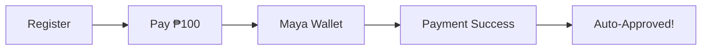

# PayMaya Implementation via PayMongo

## Overview

This document describes the implementation of **PayMaya** (Maya Wallet) deep link payment via PayMongo. Instead of displaying a QR code to scan, users will be redirected to the Maya Wallet app directly when clicking the payment link.

## Important: PayMaya vs Maya

> **Note**: PayMongo uses **"paymaya"** (not "maya") as the payment method identifier.

| PayMongo Field           | Value         | Description                 |
| ------------------------ | ------------- | --------------------------- |
| `payment_method_allowed` | `["paymaya"]` | For payment intent          |
| `type`                   | `"paymaya"`   | For payment method creation |

---

## Changes Made

### 1. Updated `src/utils/paymongo.utils.ts`

- Changed `payment_method_allowed` from `"qrph"` to `"paymaya"`
- Changed payment method type from `"qrph"` to `"paymaya"`
- Renamed function `attachGCashToIntent` → `attachMayaToIntent`
- Updated return object to only return `redirectUrl` (no QR code)

### 2. Updated `src/modules/order/order.service.ts`

- Changed variable names: `gcashRedirectUrl` → `mayaRedirectUrl`
- Removed `gcashQrCodeUrl` variable
- Updated comment to reflect PayMaya flow
- Updated return statement to use `mayaRedirectUrl`

### 3. Updated `src/modules/order/order.types.ts`

- Changed `PlaceOrderResult` interface:
  - Removed: `gcashRedirectUrl` and `qrCodeUrl`
  - Added: `mayaRedirectUrl` (deep link to open Maya app)

### 4. Updated `src/modules/affiliates/affiliate.service.ts`

- Changed function call from `attachGCashToIntent` → `attachMayaToIntent`
- Removed `qrCodeUrl` from return object

### 5. Updated `src/modules/affiliate-pixel/affiliate-pixel.service.ts`

- Made pixel events non-blocking (returns result instead of throwing error when token not configured)

---

## Workflow Process

### End-to-End Flow



### Step-by-Step Process

1. **User Initiates Checkout**
   - User selects payment method (labeled as "gcash" in frontend)
   - Frontend sends order request to `/api/orders`

2. **Create Payment Intent**
   - Backend calls `createPaymentIntent()` with amount
   - PayMongo creates intent with `payment_method_allowed: ["paymaya"]`

3. **Attach PayMaya Payment Method**
   - Backend calls `attachMayaToIntent()`
   - Creates payment method of type `"paymaya"`
   - Returns `redirectUrl` (deep link to Maya Wallet app)

4. **Frontend Displays Link**
   - Frontend receives `mayaRedirectUrl`
   - Displays as clickable link/button
   - User clicks to open Maya Wallet

5. **Payment Completion**
   - User completes payment in Maya Wallet app
   - PayMongo redirects back to `returnUrl`
   - Webhook notifies backend of payment status
   - Order is confirmed and stock is deducted

---

## Key Differences: QRPH vs PayMaya

| Feature        | QRPH (Previous)                    | PayMaya (New)                         |
| -------------- | ---------------------------------- | ------------------------------------- |
| Payment Type   | QR Code                            | Deep Link                             |
| User Action    | Scan QR with any wallet app        | Click link opens Maya directly        |
| Implementation | `payment_method_allowed: ["qrph"]` | `payment_method_allowed: ["paymaya"]` |
| Return Data    | `qrCodeUrl` (base64 image)         | `redirectUrl` (deep link URL)         |

---

## Frontend Integration

The frontend needs to:

1. Display the `mayaRedirectUrl` as a clickable link or button
2. When clicked, it will open the Maya Wallet app on the user's device
3. Handle the callback after payment completion

### Example Code

```typescript
// After receiving response from /api/orders
const response = await fetch("/api/orders", {
  method: "POST",
  body: JSON.stringify({
    /* order data */
  }),
});

const { mayaRedirectUrl, order } = await response.json();

if (mayaRedirectUrl) {
  // Option 1: Redirect directly
  window.location.href = mayaRedirectUrl;

  // Option 2: Display as button
  // <a href={mayaRedirectUrl} target="_blank">Pay with Maya Wallet</a>
}
```

---

## Affiliate Payment Flow

The same PayMaya integration is used for affiliate registration fees:

1. User registers as affiliate (`POST /api/affiliates`)
2. System creates payment intent for ₱100
3. User pays via Maya Wallet
4. Payment verified → Affiliate automatically activated



---

## Testing Checklist

- [ ] Create order with gcash payment method
- [ ] Verify redirect URL is returned
- [ ] Click link opens Maya Wallet app (or test URL)
- [ ] Complete payment in Maya
- [ ] Verify order status updates to "confirmed"
- [ ] Verify stock is deducted
- [ ] Test webhook for failed payments

---

## Error Handling

### Common Errors

| Error                                  | Cause                            | Solution                           |
| -------------------------------------- | -------------------------------- | ---------------------------------- |
| `paymaya is an invalid payment_method` | Used "maya" instead of "paymaya" | Use "paymaya"                      |
| `Meta access token not configured`     | No META_ACCESS_TOKEN env         | Add token or ignore (non-blocking) |

### Non-Blocking Pixel Events

Pixel events now return a failed result instead of throwing an error when the Meta access token is not configured. This allows payments to work even without Meta Pixel integration.
