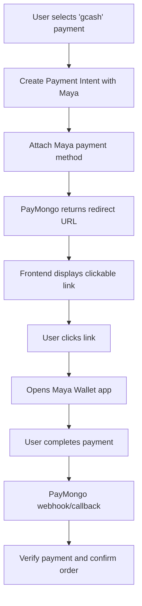

# Maya Wallet Implementation via PayMongo

## Overview

This document describes the implementation of Maya Wallet deep link payment via PayMongo. Instead of displaying a QR code to scan, users will be redirected to the Maya Wallet app directly when clicking the payment link.

## Changes Made

### 1. Updated `src/utils/paymongo.utils.ts`

- Changed `payment_method_allowed` from `"qrph"` to `"maya"`
- Renamed function `attachGCashToIntent` → `attachMayaToIntent`
- Changed payment method type from `"qrph"` to `"maya"`
- Updated return object to only return `redirectUrl` (no QR code)

### 2. Updated `src/modules/order/order.service.ts`

- Changed variable names: `gcashRedirectUrl` → `mayaRedirectUrl`
- Removed `gcashQrCodeUrl` variable
- Updated comment to reflect Maya Wallet flow
- Updated return statement to use `mayaRedirectUrl`

### 3. Updated `src/modules/order/order.types.ts`

- Changed `PlaceOrderResult` interface:
  - Removed: `gcashRedirectUrl` and `qrCodeUrl`
  - Added: `mayaRedirectUrl` (deep link to open Maya app)

### 4. Updated `src/modules/affiliates/affiliate.service.ts`

- Changed function call from `attachGCashToIntent` → `attachMayaToIntent`
- Removed `qrCodeUrl` from return object

---

## Workflow Process



### Step-by-Step Process

1. **User Initiates Checkout**
   - User selects payment method (currently labeled as "gcash" in frontend)
   - Frontend sends order request to `/api/orders`

2. **Create Payment Intent**
   - Backend calls `createPaymentIntent()` with amount
   - PayMongo creates intent with `payment_method_allowed: ["maya"]`

3. **Attach Maya Payment Method**
   - Backend calls `attachMayaToIntent()`
   - Creates payment method of type `"maya"`
   - Attaches to payment intent
   - Returns `redirectUrl` (deep link to Maya Wallet app)

4. **Frontend Displays Link**
   - Frontend receives `mayaRedirectUrl`
   - Displays as clickable link/button
   - User clicks to open Maya Wallet

5. **Payment Completion**
   - User completes payment in Maya Wallet app
   - PayMongo redirects back to `returnUrl`
   - Webhook notifies backend of payment status
   - Order is confirmed and stock is deducted

---

## Key Differences: QRPH vs Maya Wallet

| Feature        | QRPH (Previous)                    | Maya Wallet (New)                  |
| -------------- | ---------------------------------- | ---------------------------------- |
| Payment Type   | QR Code                            | Deep Link                          |
| User Action    | Scan QR with any wallet app        | Click link opens Maya directly     |
| Implementation | `payment_method_allowed: ["qrph"]` | `payment_method_allowed: ["maya"]` |
| Return Data    | `qrCodeUrl` (base64 image)         | `redirectUrl` (deep link URL)      |

---

## Frontend Integration Notes

The frontend needs to:

1. Display the `mayaRedirectUrl` as a clickable link or button
2. When clicked, it will open the Maya Wallet app on the user's device
3. Handle the callback after payment completion

Example frontend code:

```typescript
// After receiving response from /api/orders
const { mayaRedirectUrl, order } = response.data;

if (mayaRedirectUrl) {
  // Display Maya Wallet payment button
  window.location.href = mayaRedirectUrl;
  // OR display as button
  // <a href={mayaRedirectUrl} target="_blank">Pay with Maya Wallet</a>
}
```

---

## Testing Checklist

- [ ] Create order with gcash payment method
- [ ] Verify redirect URL is returned
- [ ] Click link opens Maya Wallet app (or test URL)
- [ ] Complete payment in Maya
- [ ] Verify order status updates to "confirmed"
- [ ] Verify stock is deducted
- [ ] Test webhook for failed payments
