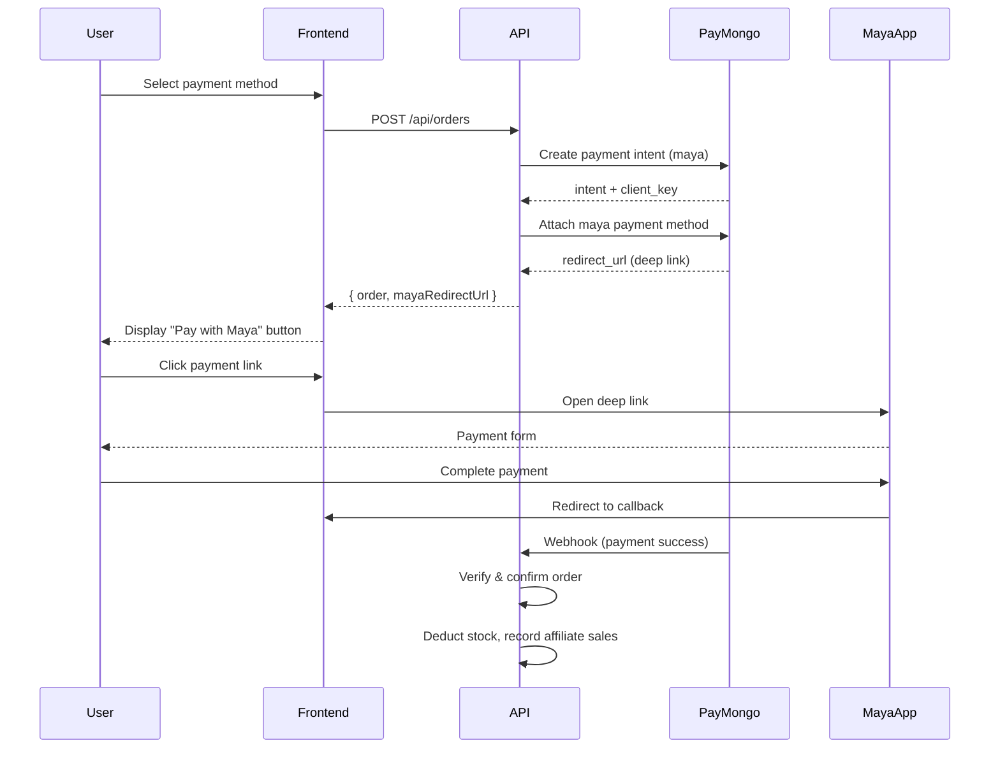

# Triad E-Commerce API - Project Overview

## 1. Project Summary

**Triad-Ecomm** is a full-featured e-commerce backend API built with:

- **Runtime**: Node.js with Express
- **Language**: TypeScript
- **Database**: Supabase (PostgreSQL)
- **Authentication**: Supabase Auth + Google OAuth
- **Payment Processing**: PayMongo (Maya Wallet, GCash, Card, COD)

---

## 2. Architecture

### Tech Stack

```
┌─────────────────────────────────────────────────────────────┐
│                     Frontend (React/Next.js)                │
└─────────────────────────────┬───────────────────────────────┘
                              │
                              ▼
┌─────────────────────────────────────────────────────────────┐
│                  Express.js API Server                      │
│  ┌─────────────┐ ┌─────────────┐ ┌─────────────────────┐  │
│  │ Middlewares │ │  Controllers│ │    Services         │  │
│  └─────────────┘ └─────────────┘ └─────────────────────┘  │
│  ┌─────────────┐ ┌─────────────┐ ┌─────────────────────┐  │
│  │ Validators  │ │ Repositories│ │    Utilities        │  │
│  └─────────────┘ └─────────────┘ └─────────────────────┘  │
└─────────────────────────────┬───────────────────────────────┘
                              │
              ┌───────────────┼───────────────┐
              ▼               ▼               ▼
       ┌──────────┐   ┌───────────┐   ┌────────────┐
       │ Supabase │   │ PayMongo  │   │  Webhooks  │
       │ Database │   │ Payments  │   │            │
       └──────────┘   └───────────┘   └────────────┘
```

---

## 3. Project Structure

```
src/
├── app.ts                 # Express app setup & routes
├── server.ts              # Server entry point
│
├── common/
│   ├── constants/         # App constants (roles, etc.)
│   ├── middlewares/       # Express middlewares
│   ├── resolvers/         # Owner resolution (auth/guest)
│   ├── types/             # TypeScript declarations
│   ├── utils/             # Utility functions
│   └── validators/        # Zod validation schemas
│
├── config/
│   ├── env.ts             # Environment configuration
│   ├── supabase.ts        # Supabase client
│   └── swagger.ts         # OpenAPI spec
│
├── modules/               # Feature modules
│   ├── auth/              # Authentication (login, register, Google OAuth)
│   ├── users/             # User management
│   ├── products/          # Product catalog
│   ├── cart/              # Shopping cart
│   ├── order/             # Orders & payments (PayMongo)
│   ├── stocks/            # Inventory management
│   ├── wishlist/          # User wishlists
│   ├── testimonials/      # Product reviews
│   ├── affiliates/        # Affiliate program
│   ├── affiliates-sales/  # Affiliate commissions
│   ├── affiliate-tracking/ # Tracking clicks & attribution
│   └── affiliate-pixel/  # Meta Pixel events
│
└── utils/
    ├── paymongo.utils.ts  # Payment processing
    └── (other utilities)
```

---

## 4. API Modules

### Authentication (`/api/auth`)

- Email/password registration & login
- Google OAuth integration
- JWT token management
- Guest checkout support

### Products (`/api/products`)

- Product CRUD operations
- Image uploads
- Category management
- Stock tracking

### Cart (`/api/cart`)

- Add/remove items
- Update quantities
- Guest cart support (via `x-guest-id` header)

### Orders (`/api/orders`)

- Place order (COD, GCash/Maya, Card)
- Payment verification
- Order status tracking
- PayMongo webhook handling

### Affiliates (`/api/affiliates`)

- Affiliate registration
- Payment tracking
- Commission management

### Affiliate Tracking (`/api/affiliate-tracking`)

- Click attribution (URL params, cookies)
- Pixel store IDs
- Conversion tracking

### Affiliate Pixel (`/api/affiliate-pixel`)

- Meta Pixel event firing
- Purchase event tracking
- Store-specific pixel IDs

---

## 5. Payment Flow (PayMongo)

### Current Implementation: Maya Wallet Deep Link



### Payment Methods

| Method | Implementation | Description                              |
| ------ | -------------- | ---------------------------------------- |
| COD    | Direct         | Cash on delivery - no payment processing |
| gcash  | Maya Wallet    | Deep link to Maya Wallet app             |
| card   | PayMongo       | Credit/debit card via PayMongo           |

---

## 6. Affiliate System

### Tracking Flow

1. **Click Attribution**: Affiliate shares link with `?ref=AFFILIATE_ID`
2. **Cookie Tracking**: `x-affiliate-cookie` header tracks referred users
3. **Order Attribution**: Orders tagged with affiliate ID
4. **Pixel Events**: Meta Pixel fires on purchase

### Key Features

- Auto-create affiliate on first purchase
- Registration fee payment (via PayMongo)
- Commission tracking per sale
- Pixel event integration for Meta Ads

---

## 7. Database Schema (Key Tables)

```sql
-- Users (extends Supabase auth.users)
users

-- Products
products
product_images

-- Orders
orders
order_items

-- Affiliate System
affiliates
affiliate_sales

-- Tracking
affiliate_tracking
affiliate_pixels
```

---

## 8. Environment Variables

```env
# Supabase
SUPABASE_URL=https://xxx.supabase.co
SUPABASE_ANON_KEY=xxx
SUPABASE_SERVICE_ROLE_KEY=xxx

# App
NODE_ENV=development
PORT=3000
FRONTEND_URL=http://localhost:5173
APP_URL=http://localhost:3000
PASSWORD_PEPPER=xxx

# Payments
PAYMONGO_SECRET_KEY=xxx

# Affiliate
AFFILIATE_REGISTRATION_FEE=100
```

---

## 9. Running the Project

### Development

```bash
npm run dev
# Server runs on http://localhost:3000
# Swagger UI: http://localhost:3000/api/docs
```

### Build

```bash
npm run build
npm start
```

### Database

```bash
npm run db:migrate      # Push migrations
npm run db:types        # Generate TypeScript types
```

---

## 10. API Documentation

Swagger UI is available at `/api/docs` in development mode.

### Key Endpoints

| Endpoint                             | Method       | Description          |
| ------------------------------------ | ------------ | -------------------- |
| `/api/auth/register`                 | POST         | Register new user    |
| `/api/auth/login`                    | POST         | Login user           |
| `/api/products`                      | GET/POST     | List/Create products |
| `/api/cart`                          | GET/POST/PUT | Cart operations      |
| `/api/orders`                        | POST         | Place order          |
| `/api/orders/verify-gcash/:intentId` | GET          | Verify payment       |
| `/api/affiliates`                    | GET/POST     | Affiliate operations |
| `/api/affiliate-tracking/track`      | POST         | Track click          |

---

## 11. Security Features

- Helmet.js for HTTP headers
- CORS configuration
- Rate limiting
- Input sanitization
- Parameter pollution protection
- Zod validation
- RLS policies (Supabase)
- Secure password hashing (bcrypt)
