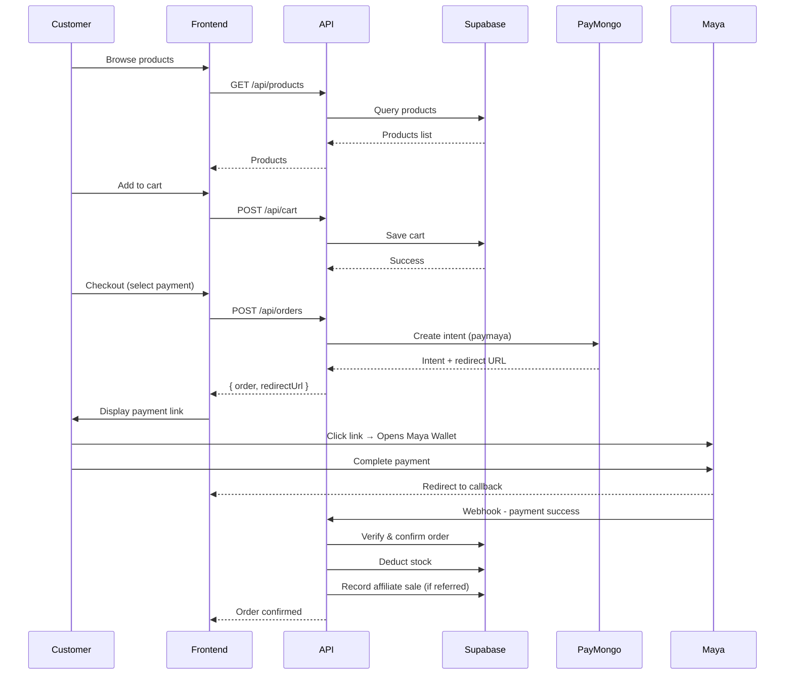
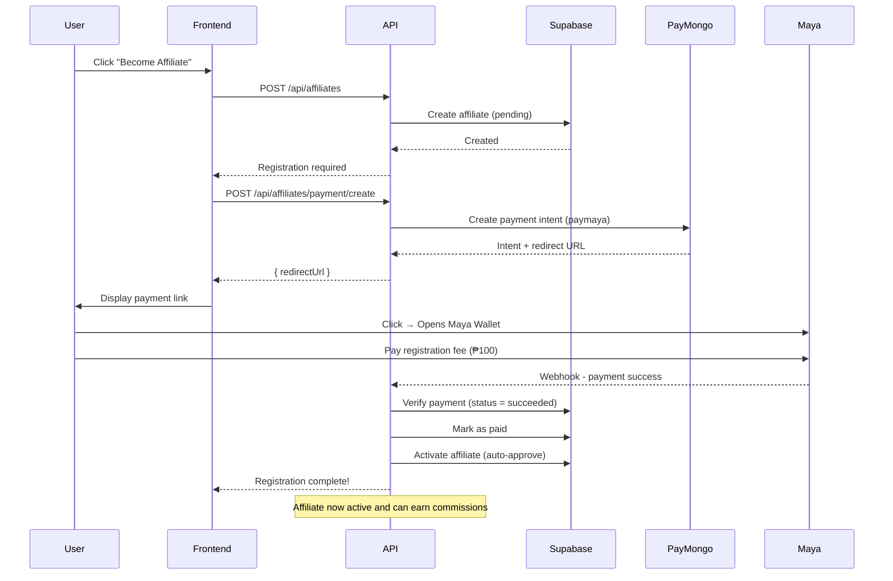
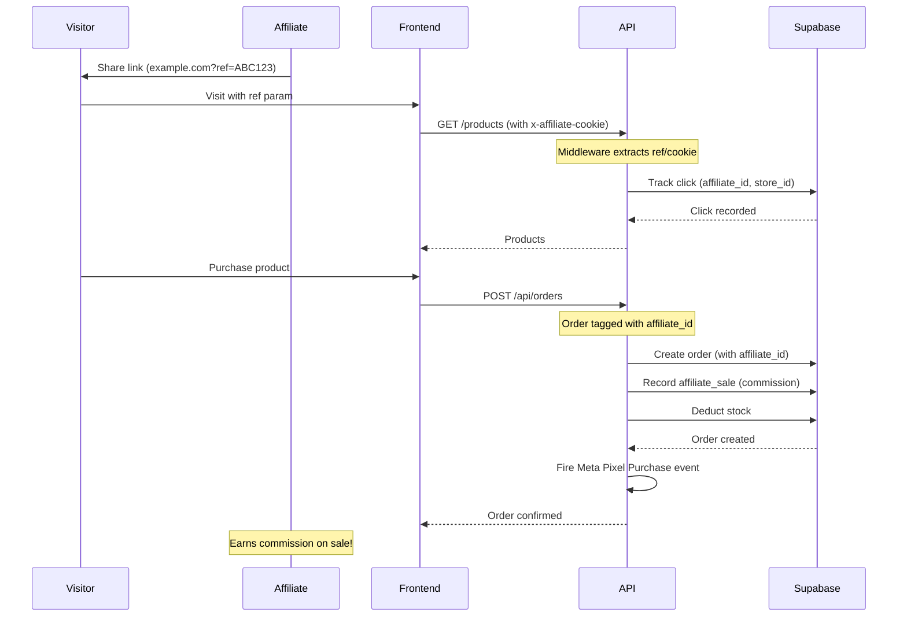

# Triad E-Commerce API - Project Overview

## 1. Project Summary

**Triad-Ecomm** is a full-featured e-commerce backend API with affiliate marketing capabilities.

### Tech Stack

| Layer          | Technology                               |
| -------------- | ---------------------------------------- |
| Runtime        | Node.js                                  |
| Framework      | Express.js                               |
| Language       | TypeScript                               |
| Database       | Supabase (PostgreSQL)                    |
| Authentication | Supabase Auth + Google OAuth             |
| Payments       | PayMongo (Maya Wallet, GCash, Card, COD) |
| Analytics      | Meta Pixel Events                        |

---

## 2. Project Structure

```
src/
├── app.ts                 # Express app setup & route registration
├── server.ts              # Server entry point
│
├── common/
│   ├── constants/         # App constants (roles, etc.)
│   ├── middlewares/       # Express middlewares
│   │   ├── affiliateTracking.ts   # Tracks affiliate referrals
│   │   ├── errorHandler.ts         # Global error handling
│   │   ├── logger.ts               # HTTP logging
│   │   ├── rateLimiter.ts          # Rate limiting
│   │   └── sanitize.ts             # Input sanitization
│   ├── resolvers/
│   │   └── owner.resolver.ts       # Auth/Guest resolution
│   ├── types/             # TypeScript declarations
│   ├── utils/             # AppError, catchAsync, response
│   └── validators/        # Zod validation schemas
│
├── config/
│   ├── env.ts             # Environment configuration
│   ├── supabase.ts        # Supabase client
│   └── swagger.ts         # OpenAPI spec
│
├── modules/               # Feature modules
│   ├── auth/              # Authentication
│   │   ├── auth.controller.ts
│   │   ├── auth.routes.ts
│   │   ├── auth.service.ts
│   │   ├── auth.middleware.ts
│   │   └── auth.validation.ts
│   │
│   ├── users/             # User management
│   │
│   ├── products/          # Product catalog
│   │   ├── products.controller.ts
│   │   ├── products.routes.ts
│   │   ├── products.service.ts
│   │   ├── products.repository.ts
│   │   └── products.admin.controller.ts
│   │
│   ├── cart/              # Shopping cart
│   │   ├── cart.controller.ts
│   │   ├── cart.routes.ts
│   │   ├── cart.service.ts
│   │   └── cart.repository.ts
│   │
│   ├── order/             # Orders & payments
│   │   ├── order.controller.ts
│   │   ├── order.routes.ts
│   │   ├── order.service.ts      # Payment processing
│   │   └── order.repository.ts
│   │
│   ├── stocks/            # Inventory management
│   │
│   ├── wishlist/          # User wishlists
│   │
│   ├── testimonials/      # Product reviews
│   │
│   ├── affiliates/        # Affiliate program
│   │   ├── affiliate.controller.ts
│   │   ├── affiliate.routes.ts
│   │   ├── affiliate.service.ts  # Payment & activation
│   │   ├── affiliate.repository.ts
│   │   └── affiliate.types.ts
│   │
│   ├── affiliates-sales/  # Affiliate commissions
│   │
│   ├── affiliate-tracking/ # Click attribution
│   │   ├── affiliate-tracking.controller.ts
│   │   ├── affiliate-tracking.routes.ts
│   │   ├── affiliate-tracking.service.ts
│   │   └── affiliate-tracking.repository.ts
│   │
│   └── affiliate-pixel/   # Meta Pixel events
│       ├── affiliate-pixel.controller.ts
│       ├── affiliate-pixel.routes.ts
│       ├── affiliate-pixel.service.ts
│       ├── affiliate-pixel.repository.ts
│       └── affiliate-pixel.utils.ts
│
└── utils/
    └── paymongo.utils.ts  # Payment processing (Maya Wallet)
```

---

## 3. API Modules

### Authentication (`/api/auth`)

| Endpoint           | Method | Description                 |
| ------------------ | ------ | --------------------------- |
| `/register`        | POST   | Email/password registration |
| `/login`           | POST   | Email/password login        |
| `/google`          | GET    | Google OAuth redirect       |
| `/google/callback` | GET    | Google OAuth callback       |
| `/me`              | GET    | Get current user            |

### Products (`/api/products`)

| Endpoint | Method | Description                     |
| -------- | ------ | ------------------------------- |
| `/`      | GET    | List products (with pagination) |
| `/`      | POST   | Create product (admin)          |
| `/:id`   | GET    | Get product details             |
| `/:id`   | PUT    | Update product (admin)          |
| `/:id`   | DELETE | Delete product (admin)          |

### Cart (`/api/cart`)

| Endpoint   | Method | Description           |
| ---------- | ------ | --------------------- |
| `/`        | GET    | Get cart items        |
| `/`        | POST   | Add item to cart      |
| `/:itemId` | PUT    | Update item quantity  |
| `/:itemId` | DELETE | Remove item from cart |

### Orders (`/api/orders`)

| Endpoint                  | Method | Description           |
| ------------------------- | ------ | --------------------- |
| `/`                       | POST   | Place order           |
| `/`                       | GET    | Get user orders       |
| `/:id`                    | GET    | Get order details     |
| `/verify-gcash/:intentId` | GET    | Verify payment        |
| `/webhook/paymongo`       | POST   | PayMongo webhook      |
| `/admin/all`              | GET    | All orders (admin)    |
| `/admin/:id/status`       | PATCH  | Update status (admin) |

### Affiliates (`/api/affiliates`)

| Endpoint                    | Method | Description                     |
| --------------------------- | ------ | ------------------------------- |
| `/`                         | GET    | Get my affiliate info           |
| `/`                         | POST   | Register as affiliate           |
| `/payment/create`           | POST   | Create payment for registration |
| `/payment/verify/:intentId` | GET    | Verify payment                  |
| `/admin/all`                | GET    | All affiliates (admin)          |

### Affiliate Tracking (`/api/affiliate-tracking`)

| Endpoint | Method | Description             |
| -------- | ------ | ----------------------- |
| `/track` | POST   | Track click/attribution |
| `/stats` | GET    | Get tracking stats      |

### Affiliate Pixel (`/api/affiliate-pixel`)

| Endpoint | Method | Description         |
| -------- | ------ | ------------------- |
| `/`      | GET    | List pixel configs  |
| `/`      | POST   | Create pixel config |
| `/fire`  | POST   | Fire pixel event    |

---

## 4. End-to-End Process Flows

### 4.1 Customer Purchase Flow



### 4.2 Affiliate Registration Flow



### 4.3 Affiliate Referral Flow



---

## 5. Payment Processing (PayMongo)

### Supported Payment Methods

| Method  | Type      | Description           |
| ------- | --------- | --------------------- |
| `cod`   | Direct    | Cash on delivery      |
| `gcash` | Deep Link | Maya Wallet (PayMaya) |
| `card`  | Redirect  | Credit/Debit card     |

### PayMaya Implementation Details

The API uses **PayMaya** (not Maya) as the payment method identifier:

```typescript
// In paymongo.utils.ts
const paymentIntent = {
  payment_method_allowed: ["paymaya"], // PayMaya identifier
};

// When attaching payment method
const paymentMethod = {
  type: "paymaya", // Creates deep link to Maya Wallet
};
```

### Payment Flow

1. **Create Payment Intent** → API calls PayMongo to create intent
2. **Attach Payment Method** → Creates PayMaya payment method
3. **Get Redirect URL** → PayMongo returns deep link
4. **User Pays** → Opens Maya Wallet, completes payment
5. **Verify** → Webhook or callback verifies payment
6. **Confirm** → Order confirmed, stock deducted, affiliate credited

---

## 6. Affiliate System

### Affiliate Status Flow

```
[New User]
    ↓ (registers)
[Pending] - Needs to pay registration fee
    ↓ (pays ₱100)
[Paid] - Payment verified
    ↓ (auto-activated)
[Active] - Can earn commissions
    ↓ (makes sale)
[Commission] - Earns from referrals
```

### Auto-Approval

After successful payment:

```typescript
// In affiliate.service.ts - verifyAffiliatePayment()
if (status === "succeeded") {
  await markAsPaidByUserId(userId); // Mark paid
  await activateByUserId(userId); // Auto-approve!
}
```

### Commission Tracking

- Commission recorded in `affiliate_sales` table
- Calculated per order
- Can be triggered on:
  - Order payment confirmed (GCash)
  - Order delivered (COD)

---

## 7. Meta Pixel Integration

### Supported Events

| Event      | Trigger                |
| ---------- | ---------------------- |
| `Lead`     | Affiliate registration |
| `Purchase` | Order completed        |

### Pixel Configuration

Each affiliate can have:

- `pixel_id` - Meta Pixel ID
- `store_id` - Store identifier
- Access token configured via env: `META_ACCESS_TOKEN`

---

## 8. Database Schema

### Key Tables

```sql
-- Users (extends Supabase auth)
users

-- Products
products
product_images

-- Shopping
cart_items
orders
order_items

-- Affiliate System
affiliates
  - user_id
  - payment_status (pending/paid)
  - status (pending/active)
  - pixel_id
  - store_id

affiliate_sales
  - affiliate_id
  - order_id
  - commission_amount

-- Tracking
affiliate_tracking
  - affiliate_id
  - click_id
  - store_id
  - tracking_method

affiliate_pixels
  - affiliate_id
  - pixel_id
  - store_id
```

---

## 9. Environment Variables

```env
# Supabase
SUPABASE_URL=https://xxx.supabase.co
SUPABASE_ANON_KEY=xxx
SUPABASE_SERVICE_ROLE_KEY=xxx

# App
NODE_ENV=development
PORT=3000
FRONTEND_URL=http://localhost:5173
APP_URL=http://localhost:3000
PASSWORD_PEPPER=your-secure-pepper-min-16-chars

# Payments
PAYMONGO_SECRET_KEY=sk_live_xxx

# Affiliate
AFFILIATE_REGISTRATION_FEE=100

# Meta Pixel (optional)
META_ACCESS_TOKEN=xxx
```

---

## 10. Running the Project

### Development

```bash
npm run dev
# Server: http://localhost:3000
# Swagger: http://localhost:3000/api/docs
```

### Build & Production

```bash
npm run build
npm start
```

### Database

```bash
npm run db:migrate      # Push migrations
npm run db:types        # Generate TypeScript types
```

---

## 11. Security Features

- **Helmet.js** - HTTP security headers
- **CORS** - Configured for frontend origin
- **Rate Limiting** - Prevents abuse
- **Input Sanitization** - MongoDB sanitize
- **Zod Validation** - Request validation
- **RLS Policies** - Supabase row-level security
- **Password Hashing** - bcrypt
- **Parameter Pollution** - HPP protection

---

## 12. API Documentation

Swagger UI is available at `/api/docs` in development mode.

### Quick Links

| Resource     | Path               |
| ------------ | ------------------ |
| Swagger UI   | `/api/docs`        |
| Swagger JSON | `/api/docs.json`   |
| Health Check | `/health`          |
| Google OAuth | `/api/auth/google` |
