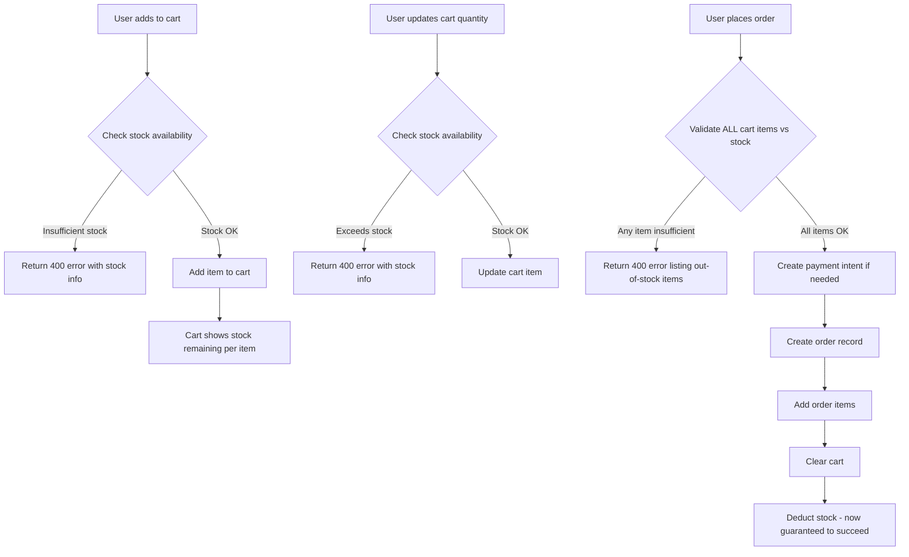

# Stock Validation & Deduction Plan

## Current State Analysis

### What Already Works

- [`PlaceOrder.deductStock()`](src/application/use-cases/order/PlaceOrder.ts:302) — stock IS deducted after order is saved, but silently warns instead of throwing when stock is insufficient.
- [`SupabaseStockRepository.upsert()`](src/infrastructure/database/supabase/SupabaseStockRepository.ts:89) — correctly updates stock quantity.
- [`GetStockAvailabilityUseCase`](src/application/use-cases/stocks/GetStockAvailability.ts:27) — returns `{ available: boolean }` only.

### Problems Found

#### 1. `SupabaseStockRepository.findByProductId` throws instead of returning null

[`findByProductId()`](src/infrastructure/database/supabase/SupabaseStockRepository.ts:75) uses `.single()` which throws a 404 `AppError` when no stock record exists. This means `PlaceOrder.deductStock()` silently catches the error and skips deduction — stock is never deducted for products with no stock record.

#### 2. No stock validation before order creation in `PlaceOrder`

[`PlaceOrder.execute()`](src/application/use-cases/order/PlaceOrder.ts:94) deducts stock **after** the order is created and payment intent is generated (step 9). If stock is insufficient, the order is already saved and payment may already be initiated. Stock validation must happen **before** order creation.

#### 3. No stock check in `AddToCart`

[`AddToCartUseCase.execute()`](src/application/use-cases/cart/AddToCart.ts:51) does not check if the requested quantity is available in stock. Users can add more items than available.

#### 4. No stock check in `UpdateCartItem`

[`UpdateCartItemUseCase.execute()`](src/application/use-cases/cart/UpdateCartItem.ts:50) does not validate that the new quantity is within available stock.

#### 5. `GetStockAvailability` only returns boolean

[`GetStockAvailabilityOutput`](src/application/use-cases/stocks/GetStockAvailability.ts:20) only returns `{ available: boolean }`. It should also return `quantity` so the frontend can show "X items left".

#### 6. Cart items don't include stock info

[`SupabaseCartRepository.findAllByOwner()`](src/infrastructure/database/supabase/SupabaseCartRepository.ts:33) does not join stock data. The cart response doesn't tell the frontend how many items are left in stock for each cart item.

---

## Architecture Flow



---

## Implementation Plan

### Step 1 — Fix `SupabaseStockRepository.findByProductId`

**File:** [`src/infrastructure/database/supabase/SupabaseStockRepository.ts`](src/infrastructure/database/supabase/SupabaseStockRepository.ts)

Change `.single()` to `.maybeSingle()` and return `null` instead of throwing when no record is found. This allows callers to handle missing stock gracefully.

```typescript
async findByProductId(productId: string): Promise<any> {
  const { data, error } = await supabaseAdmin
    .from("stocks")
    .select("*")
    .eq("product_id", productId)
    .maybeSingle();

  if (error) throw new AppError(error.message, 500);
  return data ?? null;
}
```

---

### Step 2 — Add stock validation in `PlaceOrder` (before order creation)

**File:** [`src/application/use-cases/order/PlaceOrder.ts`](src/application/use-cases/order/PlaceOrder.ts)

Add a new private method `validateStock()` that checks all cart items against available stock **before** creating the payment intent or order. Throw an `AppError` with a descriptive message listing which products are out of stock or have insufficient quantity.

Insert the call as step 2.5 (after calculating totals, before handling payment):

```typescript
// 3.5 Validate stock availability for all items
await this.validateStock(orderItems);
```

New method:

```typescript
private async validateStock(
  orderItems: { productId: string; quantity: number; unitPrice: number }[]
): Promise<void> {
  const insufficientItems: string[] = [];

  for (const item of orderItems) {
    const stock = await this.stockRepository.findByProductId(item.productId);
    const available = stock?.quantity ?? 0;
    if (available < item.quantity) {
      insufficientItems.push(
        `Product ${item.productId}: requested ${item.quantity}, available ${available}`
      );
    }
  }

  if (insufficientItems.length > 0) {
    throw new AppError(
      `Insufficient stock for: ${insufficientItems.join("; ")}`,
      400
    );
  }
}
```

Also fix `deductStock()` to throw instead of silently warn when stock is insufficient (since validation already passed, this is a safety net):

```typescript
private async deductStock(...): Promise<void> {
  for (const item of orderItems) {
    const currentStock = await this.stockRepository.findByProductId(item.productId);
    const newQty = (currentStock?.quantity ?? 0) - item.quantity;
    await this.stockRepository.upsert(item.productId, {
      quantity: Math.max(0, newQty),
    });
  }
}
```

---

### Step 3 — Add stock validation in `AddToCart`

**File:** [`src/application/use-cases/cart/AddToCart.ts`](src/application/use-cases/cart/AddToCart.ts)

Inject `IStockRepository` and check stock before upserting. Also account for items already in the cart (existing quantity + new quantity must not exceed stock).

```typescript
export class AddToCartUseCase {
  private readonly cartRepository: ICartRepository;
  private readonly stockRepository: IStockRepository;

  constructor(
    cartRepository?: ICartRepository,
    stockRepository?: IStockRepository,
  ) {
    this.cartRepository =
      cartRepository ?? resolve<ICartRepository>(TOKENS.ICartRepository);
    this.stockRepository =
      stockRepository ?? resolve<IStockRepository>(TOKENS.IStockRepository);
  }

  async execute(input: AddToCartInput): Promise<AddToCartOutput> {
    // ... owner resolution ...

    // Check existing cart quantity for this product
    const existing = await this.cartRepository.findItem(owner, input.productId);
    const existingQty = existing?.quantity ?? 0;
    const totalRequested = existingQty + input.quantity;

    // Check stock
    const stock = await this.stockRepository.findByProductId(input.productId);
    const available = stock?.quantity ?? 0;

    if (available === 0) {
      throw new AppError("This product is out of stock", 400);
    }
    if (totalRequested > available) {
      throw new AppError(
        `Only ${available} item(s) available in stock. You already have ${existingQty} in your cart.`,
        400,
      );
    }

    // ... proceed with upsert ...
  }
}
```

---

### Step 4 — Add stock validation in `UpdateCartItem`

**File:** [`src/application/use-cases/cart/UpdateCartItem.ts`](src/application/use-cases/cart/UpdateCartItem.ts)

Inject `IStockRepository` and validate the new quantity against available stock.

```typescript
export class UpdateCartItemUseCase {
  private readonly cartRepository: ICartRepository;
  private readonly stockRepository: IStockRepository;

  // ... constructor with stockRepository injection ...

  async execute(input: UpdateCartItemInput): Promise<UpdateCartItemOutput> {
    // ... owner resolution ...

    // Get the cart item to find productId
    const cartItems = await this.cartRepository.findAllByOwner(owner);
    const cartItem = cartItems.find((i) => i.id === input.itemId);
    if (!cartItem) {
      throw new AppError("Cart item not found", 404);
    }

    // Check stock
    const stock = await this.stockRepository.findByProductId(
      cartItem.productId,
    );
    const available = stock?.quantity ?? 0;

    if (input.quantity > available) {
      throw new AppError(`Only ${available} item(s) available in stock`, 400);
    }

    // ... proceed with updateQuantity ...
  }
}
```

---

### Step 5 — Update `GetStockAvailability` to return quantity

**File:** [`src/application/use-cases/stocks/GetStockAvailability.ts`](src/application/use-cases/stocks/GetStockAvailability.ts)

Update the output to include `quantity` so the frontend can display "X items left":

```typescript
export interface GetStockAvailabilityOutput {
  available: boolean;
  quantity: number;
}

// In execute():
return {
  available: (stock?.quantity ?? 0) > 0,
  quantity: stock?.quantity ?? 0,
};
```

---

### Step 6 — Include stock info in cart items

**File:** [`src/domain/interfaces/ICartRepository.ts`](src/domain/interfaces/ICartRepository.ts)

Add `stock` to the `CartItem.product` interface:

```typescript
export interface CartItem {
  // ...
  product?: {
    id: string;
    name: string;
    price: number;
    imageUrl: string | null;
    images?: Array<{ id: string; url: string; position: number }>;
    stock?: {
      quantity: number;
      available: boolean;
    };
  };
}
```

**File:** [`src/infrastructure/database/supabase/SupabaseCartRepository.ts`](src/infrastructure/database/supabase/SupabaseCartRepository.ts)

Update `findAllByOwner` query to join stocks:

```typescript
.select(`
  *,
  product:products (
    id,
    name,
    price,
    image_url,
    images:product_images (
      id,
      url,
      position
    ),
    stock:stocks (
      quantity
    )
  )
`)
```

And map the stock data in the response:

```typescript
product: item.product ? {
  ...item.product,
  imageUrl: item.product.image_url,
  images: item.product.images,
  stock: item.product.stock
    ? {
        quantity: item.product.stock.quantity,
        available: item.product.stock.quantity > 0,
      }
    : { quantity: 0, available: false },
} : undefined,
```

---

## Summary of Files to Change

| File                                                                                            | Change                                                                                 |
| ----------------------------------------------------------------------------------------------- | -------------------------------------------------------------------------------------- |
| [`SupabaseStockRepository.ts`](src/infrastructure/database/supabase/SupabaseStockRepository.ts) | Use `.maybeSingle()` in `findByProductId`, return `null` instead of throwing           |
| [`PlaceOrder.ts`](src/application/use-cases/order/PlaceOrder.ts)                                | Add `validateStock()` method called before payment/order creation; fix `deductStock()` |
| [`AddToCart.ts`](src/application/use-cases/cart/AddToCart.ts)                                   | Inject `IStockRepository`, validate stock + existing cart qty before adding            |
| [`UpdateCartItem.ts`](src/application/use-cases/cart/UpdateCartItem.ts)                         | Inject `IStockRepository`, validate new quantity against stock                         |
| [`GetStockAvailability.ts`](src/application/use-cases/stocks/GetStockAvailability.ts)           | Return `quantity` in addition to `available` boolean                                   |
| [`ICartRepository.ts`](src/domain/interfaces/ICartRepository.ts)                                | Add `stock` field to `CartItem.product` interface                                      |
| [`SupabaseCartRepository.ts`](src/infrastructure/database/supabase/SupabaseCartRepository.ts)   | Join `stocks` table in `findAllByOwner`, map stock data                                |
